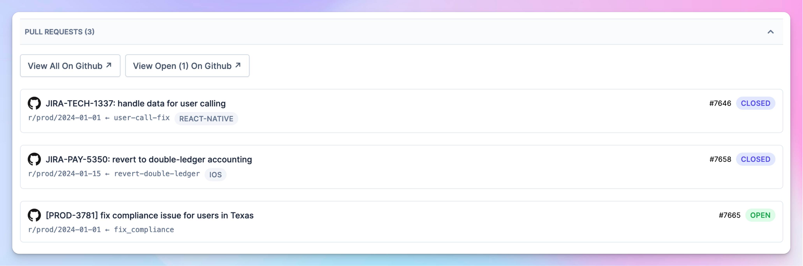
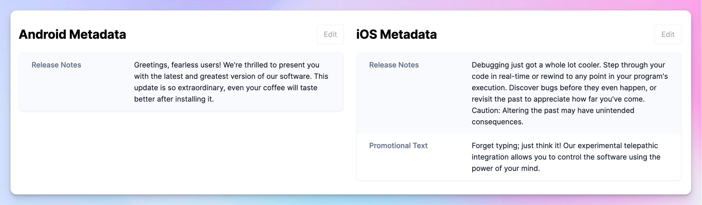
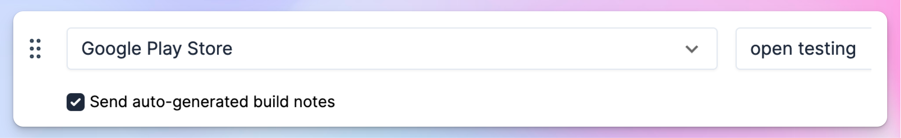

---
mdx:
 format: md
date: 2024-01-30T20:00
authors:
  - 'kitallis'
  - 'nid90'
  - 'pratul'
---

# 0.0.11

<!-- truncate -->

### Mid-release pull requests

We now track all the PRs that you create against the release branch during a release. This serves as a solid foundation for us to start tracking **behavioural** and **process-related** aspects around shipping code during a release.

Currently, we display all PRs (along with their labels), emphasizing those that haven't been merged yet. With this system in place, we can soon start gathering information, such as PRs that caused delays in a release or the size of commit diffs that were shipped after a release had already commenced.

### Release notes across both platforms

In a cross-platform release, previously, the release metadata was common across both platforms. Although simpler, it can be quite limiting. We now support adding release metadata to individual platforms for a cross-platform release. The metadata is tuned to the details the particular store expects.

We will soon launch a full-fledged marketing and release metadata management system; including support for screenshots and locales.

### Optionally select auto-generated build notes

Earlier last year, we added support for [auto-generated build notes](http://docs.tramline.app/changelog/july-27-2023#build-notes). Our users find this feature useful, but sometimes it can become spammy to send these notes to everyone; as they are generated and sent for all distribution channels that are non-prod.

Now, when setting up steps for train, you can select whether you want to generate and notify with the auto-gen build notes, so you have full control over what gets sent out to whom.

Improvements and Fixes

- Backmerge PRs now get automatically merged
- Do not compute build health metadata if there's less than one data point
- Show chart for build health metadata only when present
- If app size is sent as custom metadata, override the one computed by Tramline
- If a review is intentionally skipped by users, do not retry on deployment failure
- For the Parallel-Working-Branch branching strategy, fix a bug that was creating multiple PRs
- For the Parallel-Working-Branch branching strategy, check for diff between branches before creating PRs
- Release Schedule can now be added for all branching strategies
- Fix around inaccurate release changelogs for hotfix releases
- TestFlight releases auto-complete if they pass after a previous review failure

## Committers: 3

- Akshay Gupta ([@kitallis](https://github.com/kitallis))
- Nivedita Priyadarshini ([@nid90](https://github.com/nid90))
- Pratul Kalia ([@pratul](https://github.com/pratul))

<endcommiters/>