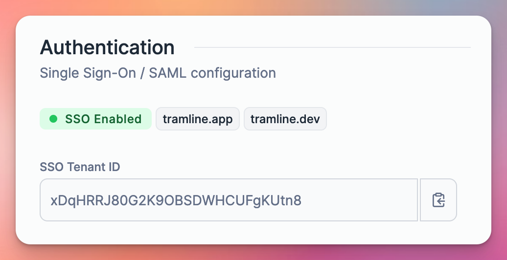
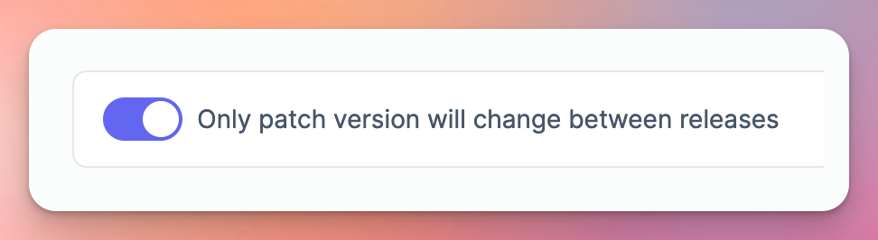

---
mdx:
 format: md
date: 2024-08-03T20:00
authors:
  - 'kitallis'
  - 'nid90'
  - 'pratul'
---

# 0.0.16

<!-- truncate -->

### Single Sign-On Support 🔑

SSO (via SAML) is now available as an authentication method in Tramline. Once enabled, all users in the organization will be required to sign in using the SSO provider.

To simplify the setup and management of SSO, we use a third-party auth service provider. However, we continue to maintain our existing email/password login natively, i.e, without relying on any third-party dependencies. This allows open-source users to self-host Tramline without the need for setting up additional accounts outside.

With this, the user access management to Tramline can be centrally managed by companies and their IT teams. This is a big step for Tramline towards supporting enterprise organizations!

### New Reldex components 📊

We [rolled out Reldex](/changelog#introducing-reldex-release-process-index-) to all users in our last major release. We have since added a few more optional components to the Reldex score:

## Days since the last release

The number of days since the last release to production was made. This is a good indicator of how much you are sticking to your regular release cadence. This is an indirect measure of drops in your deployment frequency.

## Number of rollout changes / patch fixes

Tramline classifies changes in the following ways:

- **Stability changes**: changes on the release branch during the testing phase
- **Patch fixes**: changes after the rollout to production has started
- **Hotfixes**: special releases made after the rollout to production has completed

This component now takes the "Patch fixes" into account separately, along with Stability changes and Hotfixes.

### Patch-version bumps across releases 🤛

You can now configure your release train to only bump the patch version across new releases. This is especially helpful for daily/weekly scheduled releases, where you don't want too many minor version bumps constantly as each subsequent change is likely trivial.

### Upcoming release without internal builds 🚂

The [upcoming release feature](/changelog/september-8-2023#prepare-an-upcoming-release) is now available for release trains that directly ship to beta/production (without any internal builds). This allows you to prepare the next release while the current one is still in progress. This is especially useful for teams that have a long beta period and want to get a head start on the next release.

Improvements and Fixes

- Add Indian+Indonesian languages to list of locales for release notes
- Gracefully handle lack of apps in iOS or Android projects on Firebase
- Handle double-quotes inside build notes when distributing

## Committers: 3

- Akshay Gupta ([@kitallis](https://github.com/kitallis))
- Nivedita Priyadarshini ([@nid90](https://github.com/nid90))
- Pratul Kalia ([@pratul](https://github.com/pratul))

<endcommiters/>