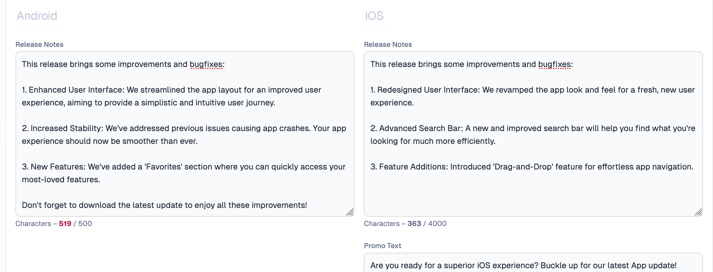

---
mdx:
 format: md
date: 2025-02-18T20:00
authors:
  - 'kitallis'
  - 'nid90'
  - 'nileshgr'
  - 'samrat'
---

# 0.0.23-2f5466

<!-- truncate -->

### Reuse Integrations across apps

Tramline now allows reusing integrations from other apps in your organization, and also from within the same app. For teams with multiple apps, access to third-party integrations like Slack and GitHub are often not accessible to the user setting up the app on Tramline. If multiple apps use the same underlying integration, you should now no longer be blocked on your Ops/Support teams for access.

  

:::info
If you only have one app, you can still reuse integrations across some categories. For example, you can reuse GitHub for both Version Control and CI/CD.
:::

### Better editing experience for Release Notes

The validations on iOS are much more strict and the error messages are clearer. Emojis and various other character rules are now disallowed, including the `<` character in particular.

Each input field: _Release Notes_, _Promo Text_ and _What's new_ now have character count hints at the bottom. The input does not disallow adding more, but only hints at trimming down so you can rewrite as necessary. Additionally, the input areas now also auto-resize as you type.

### Custom parameters for workflows

For both Internal and RC workflows, you can now add custom parameters that get passed to the workflows or jobs triggered by Tramline. These can be set in the submission settings. This is helpful when you have the same workflow doing different things based on external parameters, e.g. making a staging build and production build from the same workflow file.

:::info
These do not affect the default workflow parameters that Tramline already sends for `versionCode`, `versionName`, `commitRef` etc.
:::

:::info
Ensure that you gracefully accept the custom workflow parameters in your workflow job, otherwise the workflow trigger could fail.
:::

Improvements and Fixes

- Paginate the historical releases
- Reduce fetch frequency of release metrics from Crashlytics
- Fetch release metrics from Crashlytics only after rollout start
- Avoid fetching release metrics for stale production releases
- Better notification messaging for when the release ends
- Allow retries for failed rollouts for Google Play Store
- Avoid "Edit has been deleted" errors from Google Play Store
- Open up view-only access to configuration screens for viewers

## Committers: 4

- Akshay Gupta ([@kitallis](https://github.com/kitallis))
- Nivedita Priyadarshini ([@nid90](https://github.com/nid90))
- Samrat Man Singh ([@samrat](https://github.com/samrat))
- Nilesh GR ([@nileshgr](https://github.com/nileshgr))

<endcommiters/>