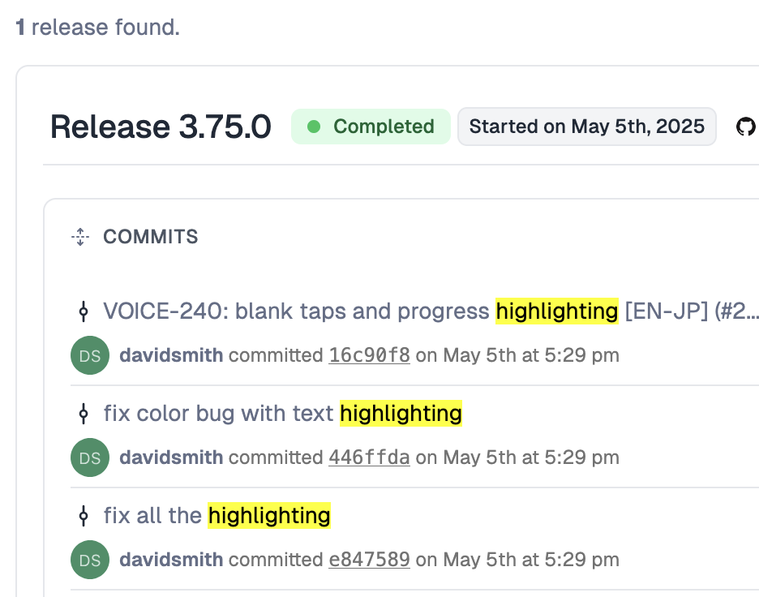
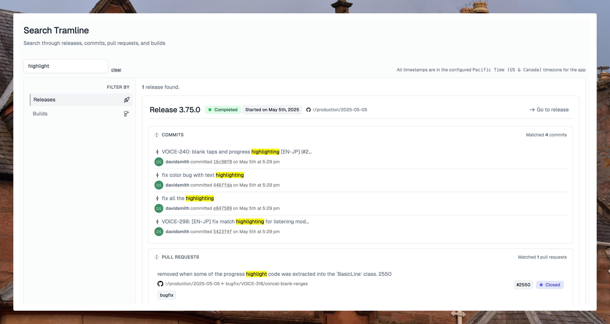

---
mdx:
 format: md
date: 2025-05-10T20:00
authors:
  - 'kitallis'
  - 'nileshgr'
  - 'samrat'
---

# 0.0.24-2f5466

<!-- truncate -->

### Search through releases

Being able to find a needle in the stack of all your releases from the past has been a highly requested feature, and we're excited to ship the very first cut of this. You can simply press `/` anywhere on the Tramline dashboard and it will take you to the search page. This search page now also engulfs the previous (and limited) search functionality around finding builds against the versionCode and/or versionName.

It's a powerful way for developers to find the release that shipped a particular feature or bug. We search through commits, authors, pull requests, labels, ticket numbers and map that onto the release they went out in. This is otherwise tricky to do manually via Git or Git interfaces without diligent and extensive annotation and tagging of changes. Since Tramline is a system of record for everything about releases, this is a big (free) unlock.

For example, you remember a tidbit of a feature or bug, say the word, <mark>"highlight"</mark>. You've forgotten the context and the details of the feature, so you just search for the term and you'll see all the pull requests and commits that match, narrowed down to the release in which they were first introduced.

This is a powerful debugging and auditing tool that doesn't require any extra state management in source control or sifting through changelogs on Slack.

### Skip the next scheduled release

  

A quick quality-of-life enhancement for scheduled release users, allowing you to skip just the next upcoming release (not the future ones). This is actually helps cover up a lot of existing limitations with automatic scheduled releases:

1. You can skip, cram more work in the last moment and then release it later manually
2. You can skip, and release a major version, since scheduled releases only bump up minor
3. You can skip, and forego that week's release, for when there are short holidays and such

This is different from the current "deactivate" functionality, that disables all the scheduled releases and the entire release train indefinitely.

### VCS integrations can be disconnected

  

VCS providers don't really change that often, but this feature is particularly useful when you're changing accounts within the same VCS provider, for example, you're moving from a regular GitHub account to an enterprise account, or if you're using Bitbucket, and you're switching the owner of the integration to be a different user, you can simply disconnect the current integration and reconnect it in the new way. This does not affect the state or data of any of the previous releases against the previous integration.

### Workflow triggers gracefully fail

Tramline so far, has always synchronized the state of the workflows that generate different types of builds. But sometimes, especially when initially setting up the release, workflow failures can be a bit of a pain to debug. Errors such as missing `workflow_dispatch` configs, invalid input parameters, etc., are now clearly surfaced on the dashboard.

Improvements and Fixes

- Increase the max number of pages for fetching repositories in Bitbucket
- If a PR closes during a Tramline-attempted merge, accept and move on
- Allow resubmitting the same iOS build again
- All input selections now have an upper limit of 100 items

## Committers: 3

- Akshay Gupta ([@kitallis](https://github.com/kitallis))
- Samrat Man Singh ([@samrat](https://github.com/samrat))
- Nilesh GR ([@nileshgr](https://github.com/nileshgr))

<endcommiters/>