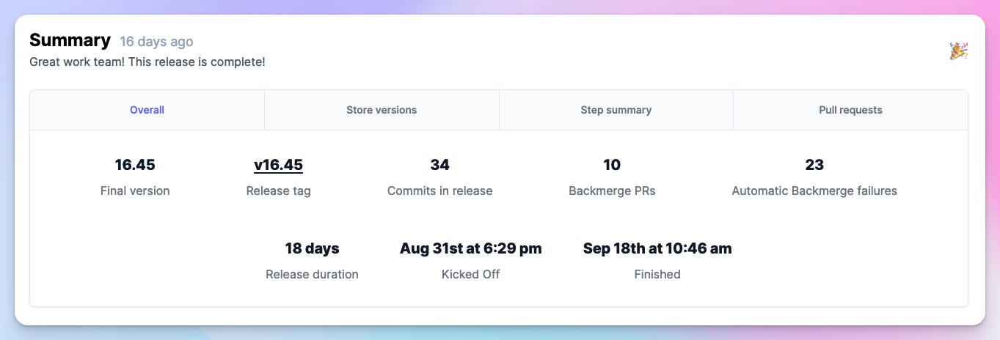
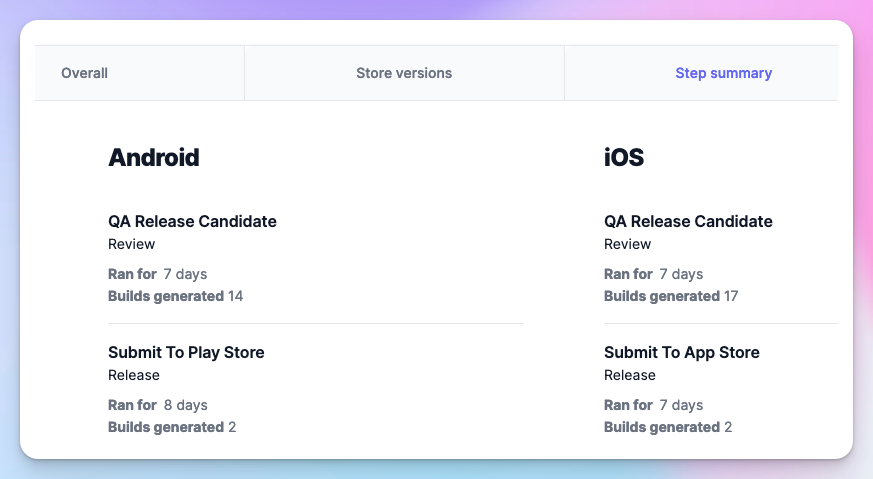
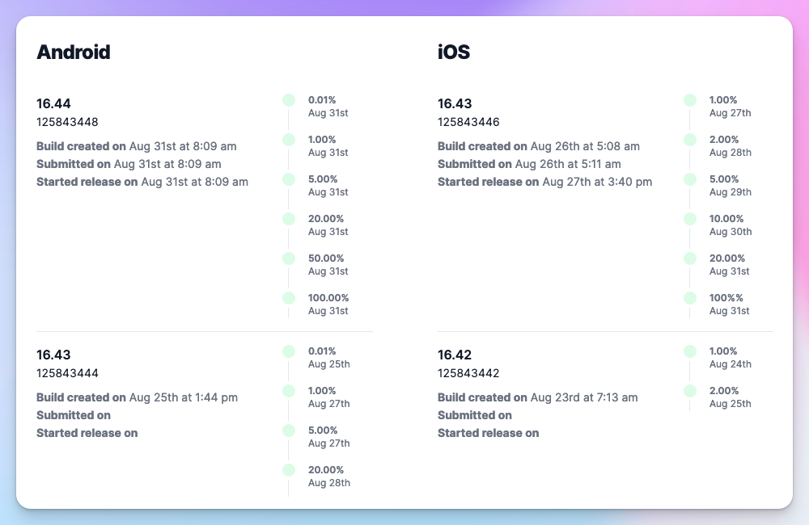
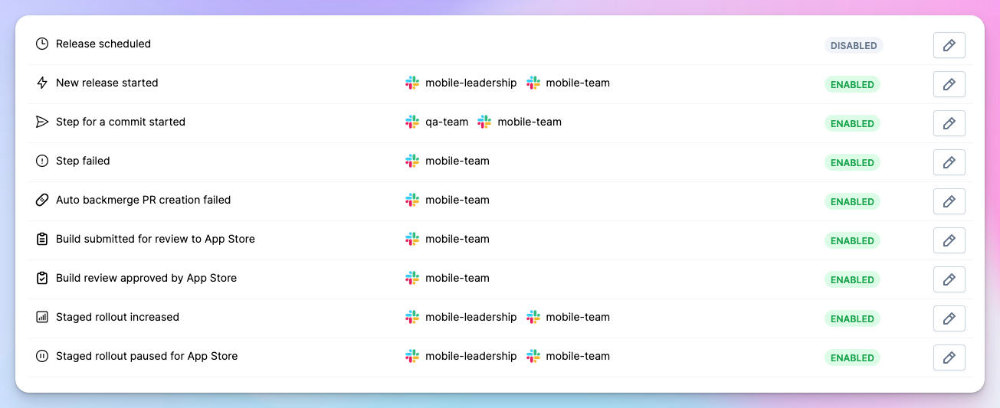

---
mdx:
 format: md
date: 2023-10-05T20:00
authors:
  - 'kitallis'
  - 'nid90'
  - 'pratul'
---

# 0.0.7

<!-- truncate -->

### Enriched Release Summary

For most teams, a release lasts more than a week and a lot happens in that time. Numerous builds are generated, those builds are approved or rejected, pull requests are created for backmerges and so on. The releases are your system of record.

We now generate a summary capturing all the essentials of your release after it is completed.

This shows the total time spent on each step of the release, number of builds generated during that step and subsequently submitted to your QA team for testing and approval.

Additionally, you can see the number of versions submitted to the store for review, when they got approved, and which of those versions reached a percentage of your users during the course of the release.

The summary also includes release duration, commits that landed on the release branch, staged rollout timeline, pull requests and auto-backmerge summary.

### Better Build Notes

We've made some improvements in build (tester) notes that are sent to all non-production distribution channels (TestFlight, Firebase App Distribution), as well as the notifications themselves:

- The first build generated for the release now has all changes since the last release as build notes.
- Previously, Tramline automatically picked up the entire commit message when generating build notes. Now, you can elect to generate more compact build notes by picking just the title of the commit and ignore the multi-line description. This is especially useful for PR merge commits. This configuration can be found in the train **Settings** page.
- The build notes in the notifications are now sent as threaded messages to keep the primary post focussed and compact.

### Advanced Notification Settings

Not everyone in your team is the correct audience for all release-related notifications. So now we allow you to configure which notifications you want, and what all channels do they need to go in the **Notification Settings** page for each of your release trains.

If you feel that your team doesn't require any notifications, as everyone is already informed through Tramline, you can deactivate all notifications through the train **Settings** page.

Improvements and Fixes

- Handle some new errors from Google Play Store and add retries around the ones that can be retried without user input
- Reduce the visual footprint of a Slack notification, compact the header and footer to improve visibility of the notification content
- Some minor security updates including rate limits on forgot password requests
- The download artifact URL for the build sent in notifications is now an authenticated URL
- Fix the upcoming release flow to manage version bump correctly across the platforms when the ongoing release creates a new store version

## Committers: 3

- Nivedita Priyadarshini ([@nid90](https://github.com/nid90))
- Akshay Gupta ([@kitallis](https://github.com/kitallis))
- Pratul Kalia ([@pratul](https://github.com/pratul))

<endcommiters/>