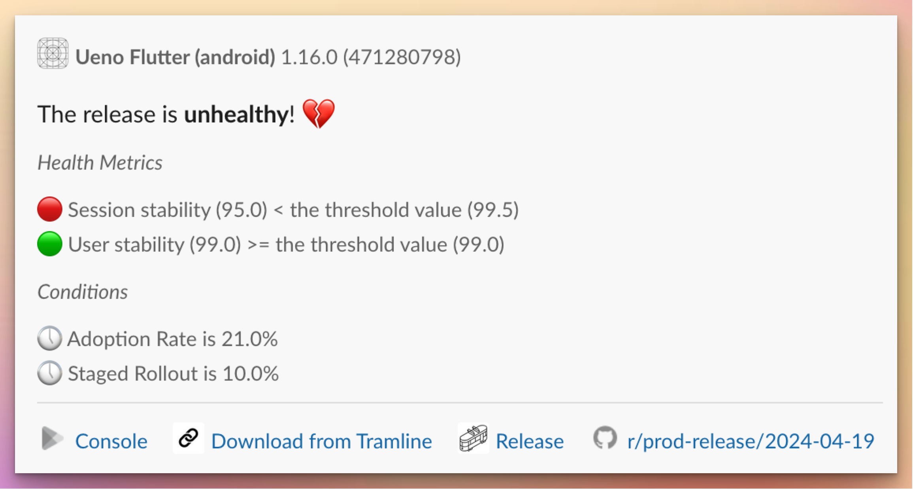
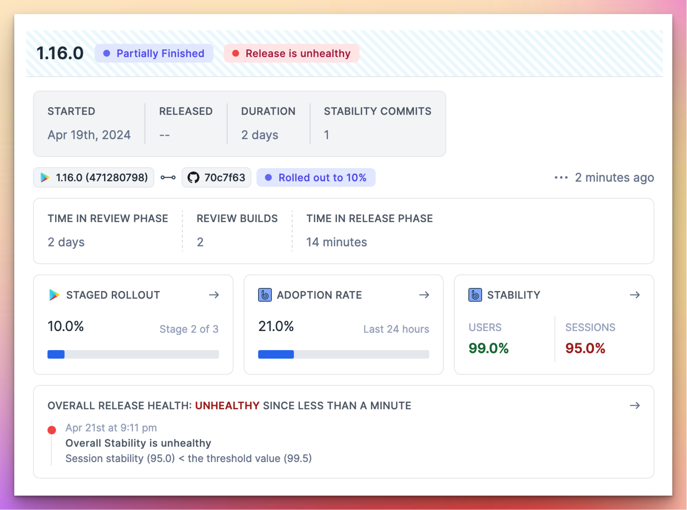

# April 22, 2024

###  Release health rules and alerts

We have introduced release health definitions to the Tramline release workflow. You can now configure multiple rules to monitor the health of your release as it gets rolled out to users.

Choose from a set of available health metrics and set thresholds for their healthiness per your own release quality benchmarks and historical data.

Once you define what makes your release healthy, Tramline will continuously monitor the health status of your release and notify you as it changes so you can take immediate action.

You can make an informed decision to halt the current rollout or resume it as your release health changes. In the future, we will automate the halt and acceleration of the rollout based on these rules.

Read more on how to configure these rules in the [docs](https://docs.tramline.app/using-tramline/release-health-monitoring).

### Attach builds with Slack notifications

When a new build is available to download from Tramline, we now attach the build to the Slack notification where it can be directly downloaded for testing or other purposes.

### User settings page

In the user settings page, users can set the team they belong to in an organization, add/update their GitHub login so their work is correctly attributed for a release, and change their name as well as their preferred name.

### Handle resubmission of build for review from the app store dashboard

When your Apple review gets rejected, Tramline now continues to poll and sync the status of the store version to ensure that the release dashboard shows the changes in review status happening outside of Tramline due to resubmission of the same build or messages back and forth with the review team.

Improvements and Fixes

- Add missing help texts to all charts
- Reduce the load time of the notification settings page
- More frequent scheduling of scheduled releases
- Add better CTA on stats cards on the release overview page
- Remove hotfixes from DevOps charts where they show up as anomalies
- Allow some more valid special characters in release notes
- Wider layout and design elements consistency and improvements

