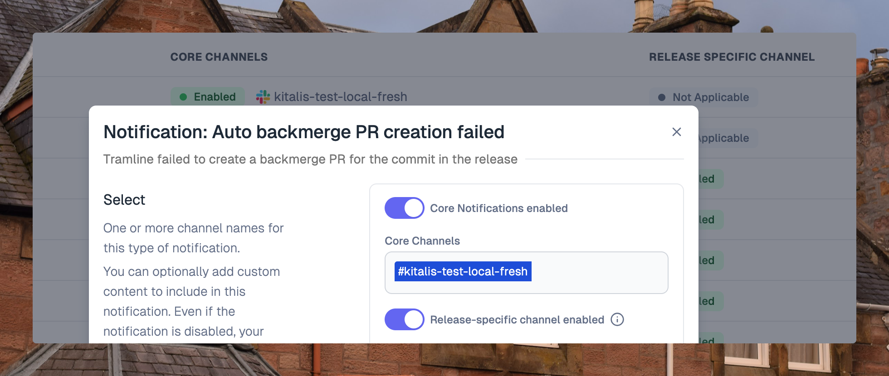
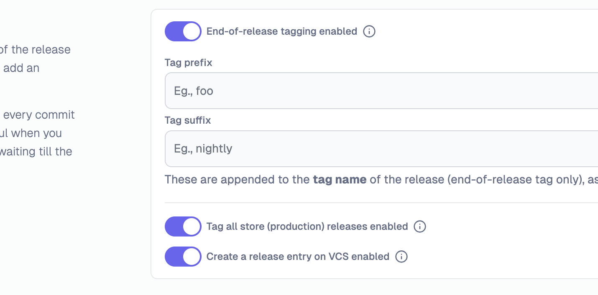

---
mdx:
 format: md
date: 2025-08-19
authors:
  - 'kitallis'
  - 'nileshgr'
  - 'samrat'
---

# August 19, 2025

### Release-Specific notification channels

Teams can now create dedicated Slack channels for individual releases, providing focused communication spaces for each release cycle. Key features include:

**Creation**: Channel is created with sanitized names including app, platform, and version

**Context**: Each channel is specific to a single release, reducing noise and improving focus

**Configuration**: Can be enabled per release train based on team preferences

This feature is particularly valuable for teams managing multiple concurrent releases or those who prefer dedicated communication channels for major releases.

### Advanced Tagging scenarios

Tramline now supports much more flexible tagging strategies to accommodate different team workflows and release processes. Teams can configure exactly when and how tags are created throughout their release lifecycle:

**End-of-Release Tagging**: Cut tags only when releases complete (with optional GitHub release)

**Rollout-Based Tagging**: Cut tags when rollouts start (with optional GitHub release)

**Platform-Specific Tags**: Include platform suffixes for cross-platform apps (like `-ios` or `-android`)

These options give teams fine-grained control over their tagging strategy, supporting everything from simple end-of-release tags to complex multi-platform, multi-rollout scenarios.

Improvements and Fixes

- Enhanced Bitbucket workflow stage halting capabilities
- Added support for APK uploads to Play Store with feature flag control
- Improved artifact attachment reliability across all platforms
- Fixed integration connection checks to properly ignore disconnected integrations
- Added confirmation dialog before refreshing Slack channels
- Implemented asynchronous CI/CD workflow list refresh functionality

<!-- truncate -->

