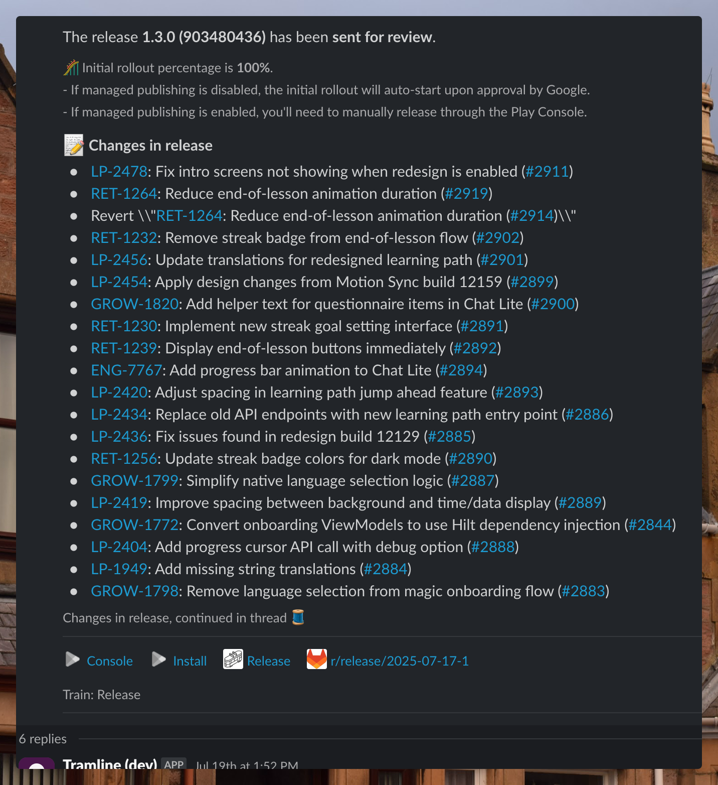
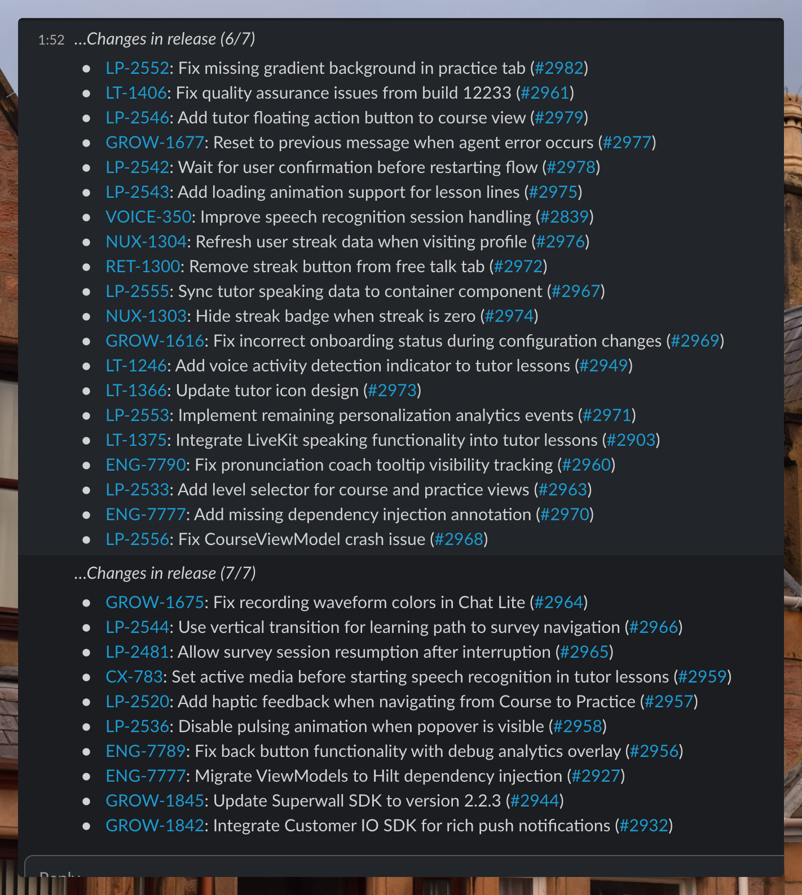
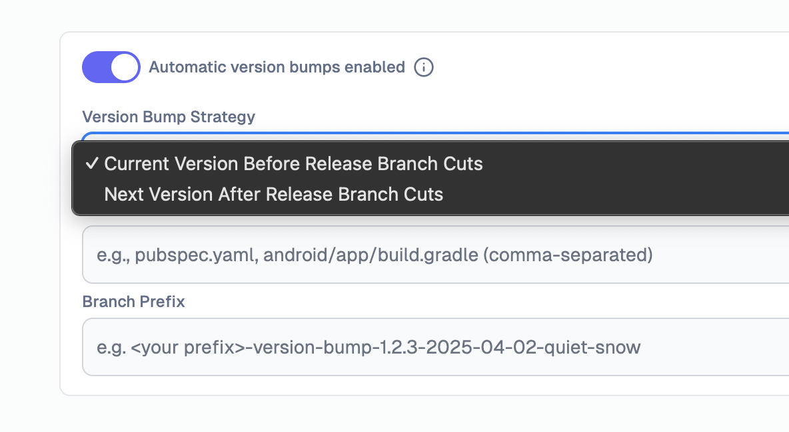

---
mdx:
 format: md
date: 2025-08-26T20:00
authors:
  - 'Animesh-Ghosh'
  - 'kitallis'
  - 'nileshgr'
---

# August 26, 2025

### Linked Tickets and PRs in changelog notifications

Changelogs now automatically detect and create clickable links for project management tickets/issues and pull requests mentioned in commit messages sent over Slack. This enhancement makes it much easier to navigate from release notes to the underlying work items and code changes. Supported integrations include:

**Version Control**: GitHub, GitLab, Bitbucket pull requests

**Project Management**: Jira tickets, Linear issues

The feature automatically detects patterns like `PROJ-123` for tickets or `#456` for pull requests and converts them into clickable links that open directly in the respective tools. This can be enabled or disabled per release train based on team preferences.

### New Release notifications

Both these new notifications have dual-set changelogs that are threaded (after 20 items) into multiple messages.

**Production Rollout Started Notifications**: When a production rollout starts, the changelogs for this release and another set for the current rollout changes (if there are multiple rollouts) are threaded into the notification.

**RC Finished Notifications**: When any RC build is generated and sent to appropriate submissions. Changes since the last RC build and all the changes since the release started are threaded in as well.

Both notifications have linked tickets (Project Management integration should be enabled) and PRs in their changelogs.

### Version Bumping strategies

Teams now have more granular control over version bumping with new strategic options for different release scenarios:

In **Current Version Before Release Branch Cuts**, Tramline will increment the version information in your code before cutting the release branch for a new release.

In **Next Version After Release Branch Cuts**, Tramline will increment the version information in your code after a release branch has been cut and the release has started.

Learn more about version bumping strategies → [here](/using-tramline/release-management/release-settings#automatic-version-bumps).

Improvements and Fixes

- Added Play Store deep links to RC finished notifications for easier access
- Improved right-side pane behavior to close when clicking outside
- Updated documentation links throughout the application
- Ensured version bump jobs only run for appropriate release strategies

<!-- truncate -->

