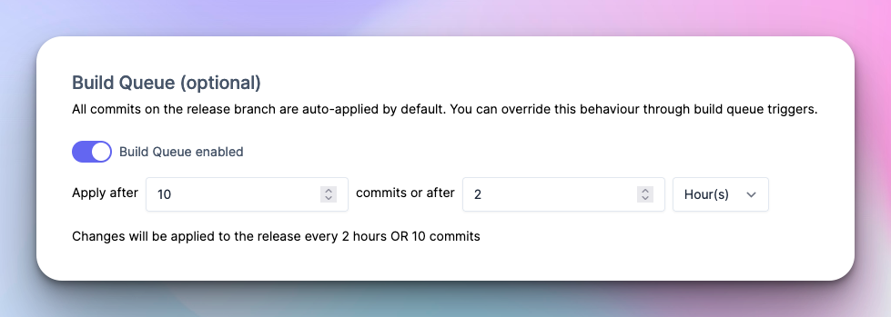
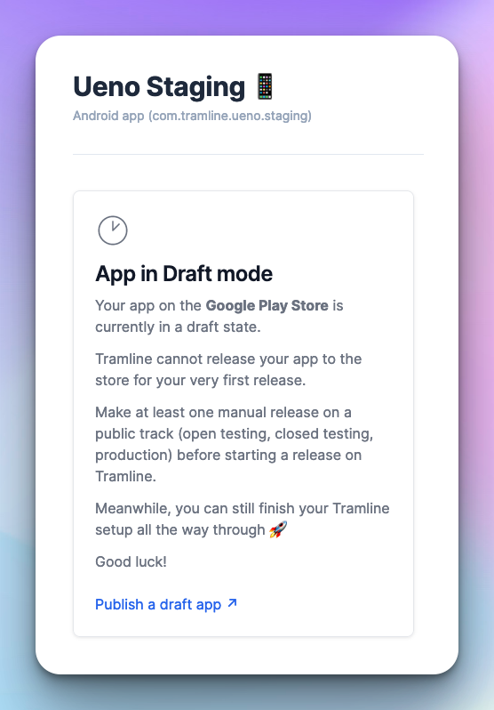

# August 28, 2023

### Build Queue

For large teams, the process of release stabilization often extends over several days. Throughout this period, testers and stakeholders may find themselves inundated with a continuous stream of new builds as bug fixes are incrementally added to the release branch.

For better control over build generation, you can now configure triggers that will batch commits based on time and volume before triggering new builds from Tramline.

You can do this under the **Settings** page of your release train.

### Support draft apps in Play Store

Users shipping brand new apps to Play Store for the very first time often face issues releasing to public channels. This is because the Play Store requires one to make an initial deploy manually before using the APIs.

To avoid having the releases fail late after everything is set up, we now detect apps that are in **Draft** mode on the Play Store and disallow making new releases until a manual public release is made from the Play Console.

### Bitrise support for cross-platform apps

When we introduced cross-platform apps in Tramline a couple of months back, the only CI/CD provider we supported was GitHub Actions.

Bitrise is now also supported as another CI/CD provider. For an example on how to configure a multi-platform (and stack) Bitrise pipeline, check out this workflow on our test bunny flutter app – [Ueno](https://github.com/tramlinehq/ueno/blob/main/bitrise.yml).

Improvements and Fixes

- Check for presence of the working branch on the git repo when creating a new release train
- Show all commits in a single push on the live release page, not just the `HEAD`
- Simplify the first train creation wizard for better onboarding
- Add platform identifiers in cross-platform release notifications
- Add missing notification for review approval from App Store
- App versions are only incremented against the previous successful release. Does not account for stopped or failed ones.
- It is now possible to configure if distributions in a release step will be automatic or manual
- More guardrails around commit recency when triggering new builds
- Release schedules can now be edited until the release train is activated

