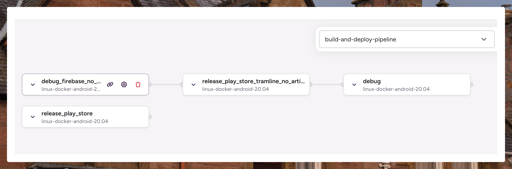
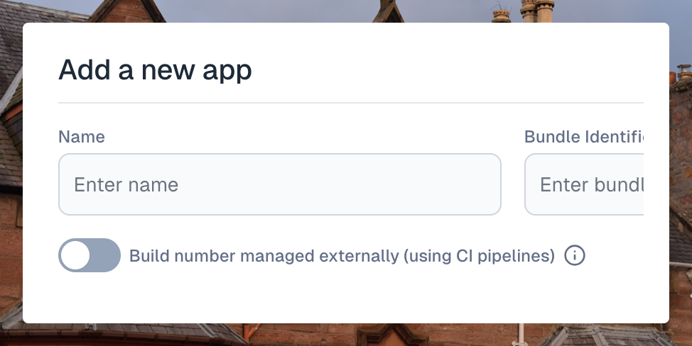

---
mdx:
 format: md
date: 2025-08-28T20:00
authors:
  - 'kitallis'
  - 'nileshgr'
---

# August 28, 2025

### Bitrise Pipeline support

Bitrise users can now also use [pipelines](https://docs.bitrise.io/en/bitrise-ci/workflows-and-pipelines/build-pipelines.html) with Tramline. This enhancement provides more flexible workflow management beyond the standard Bitrise workflow configurations.

Pipelines allow teams to:

- Use complex multi-step pipeline configurations
- Have better control on overall status tracking

### Flexible Build Number management

Teams now have full control over how build numbers are managed in their release process. Tramline supports two distinct strategies:

**Internal Management (existing)**: Tramline automatically increments build numbers for each release, maintaining consistency across your release train.

**External Management (newly added)**: Build numbers are expected to be the CI workflow numbers (typically monotonically increasing)

This flexibility is particularly useful for teams with complex versioning requirements or those who prefer to manage build numbers within their existing CI/CD infrastructure.

### Resilient Build discovery

Tramline now Automatically finds builds that were uploaded directly to app stores by CI workflows. This improvement makes the release process more robust when dealing with:

- Build artifacts that weren't properly attached during CI runs
- Direct uploads to Google Play Store or Firebase App Distribution
- Network-related artifact retrieval issues

The system will automatically retry and attempt to locate builds in the target stores, ensuring your release process continues smoothly even when build attachment fails initially.

Improvements and Fixes

- Improved Firebase build discovery logic during preprocessing phase
- Reduced retry attempts for attaching build artifacts
- Fixed Bitrise integration connection checks to only validate connected integrations
- Better error handling for GitHub parameters that aren't accepted by target workflows

<!-- truncate -->

