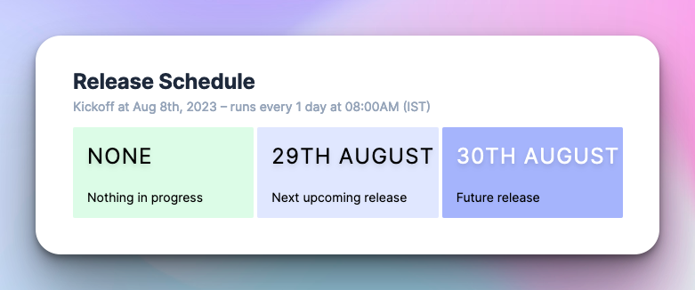

# August 9, 2023

### Scheduled releases

Releases can now be configured to run on a pre-defined schedule. You can configure this on the **Settings** page of a release train. 

A great use-case for this is to set-up nightly trains that automatically trigger latest dev builds and send them to internal teams on a consistent cadence.

### Deep links in notifications

Notifications now have deep links to both Firebase App Distribution and TestFlight builds, so you don't have to go hunting when a new RC build is available for testing.

Improvements and fixes

- Support for selecting Internal Groups as a distribution channel in TestFlight
- Release tags are now guaranteed to be unique. If a tag clashes with a previous one, we append the commit SHA to the tag!

