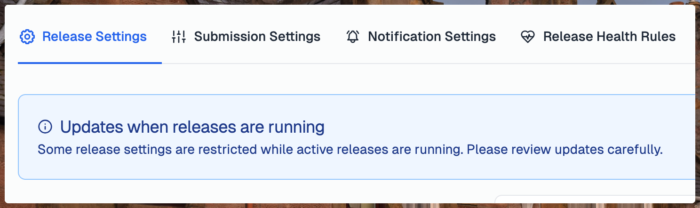
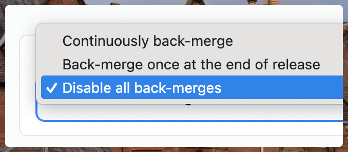

---
mdx:
 format: md
date: 2025-12-01
authors:
  - 'Animesh-Ghosh'
  - 'kitallis'
---

# December 1, 2025

### Edit release settings

Previously, Tramline blocked editing release settings while an active release was running — a sensible safeguard at the time. This restriction has now been relaxed: you can tweak your release train settings even during an ongoing release, and the changes will apply starting with the next one.

The only exception is versioning and branching strategies. These remain set-once. If you need to change them, you can create a new train and retire the current one.

This update now also allows you to tweak your release schedule (which was previously not possible).

:::note

[Submission settings](/using-tramline/release-management/release-settings#submission-settings) are always editable regardless of the state of your release.

:::

### App Icons

In app settings, you can now upload a size-compatible app icon to help visually distinguish your apps when you have multiple configured in Tramline. You can add an icon anytime, either when creating a new app or after setup.

### Disable all back-merges

Until now, Tramline let you choose between creating a single final back-merge PR at the end of a release cycle (the default) or [continuously](/using-tramline/release-management/release-settings#continuous-backmerge) creating PRs for commits landing in the release branch.

For teams following [trunk-based development](https://trunkbaseddevelopment.com), back-merges often aren’t useful. You’re typically cherry-picking all commits (*including* fixes) from trunk into the release branch.

If you follow a TBD workflow, you can now disable back-merges entirely.

Improvements and Fixes

- Upcoming releases can be started even if the previous release is partially rolled out to Production (only one store in a cross-platform release)
- If a review fails on iOS, you can now re-submit from Tramline without needing to land another commit to kick-start another cycle
- Integrations are now configured per integration, instead of per category

<!-- truncate -->

