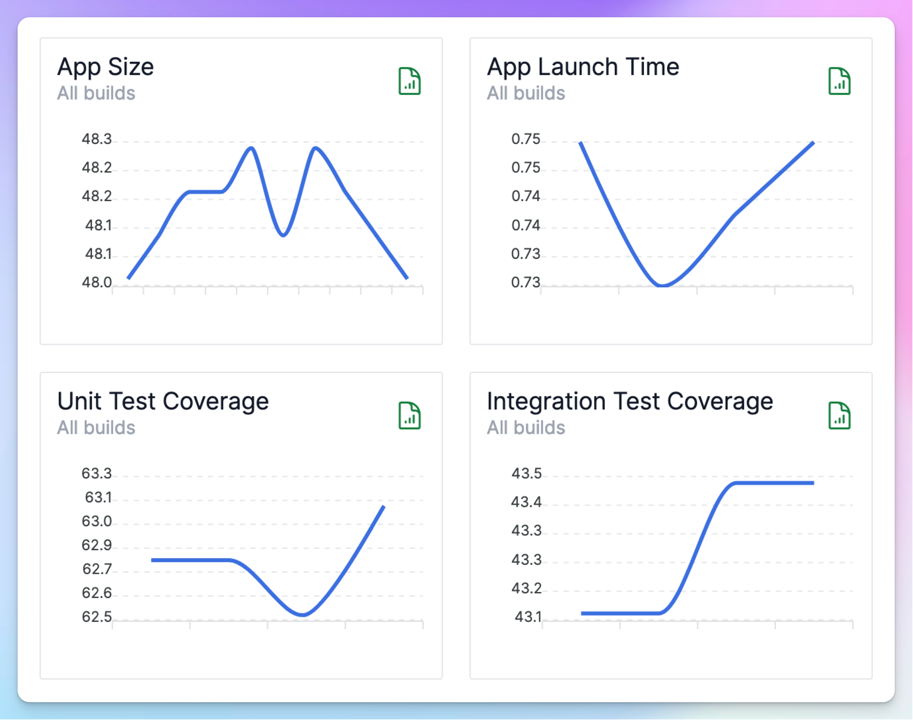
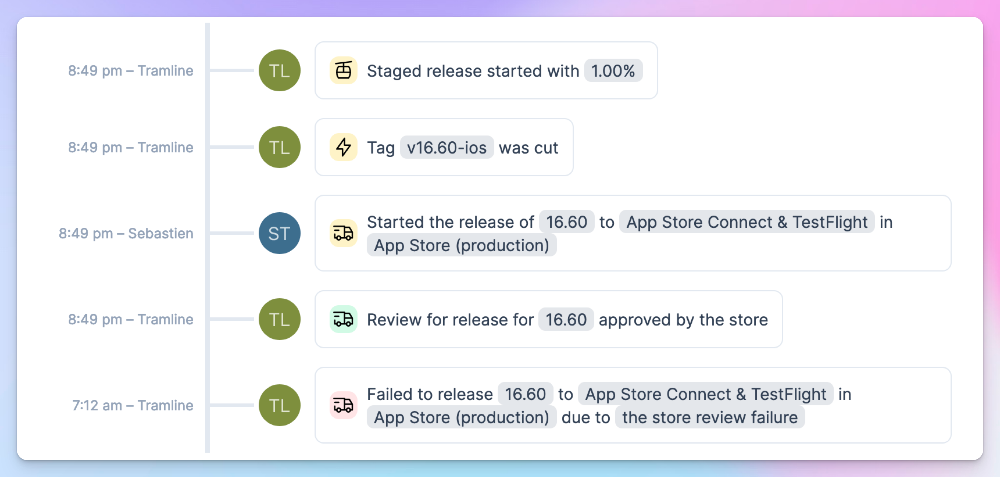
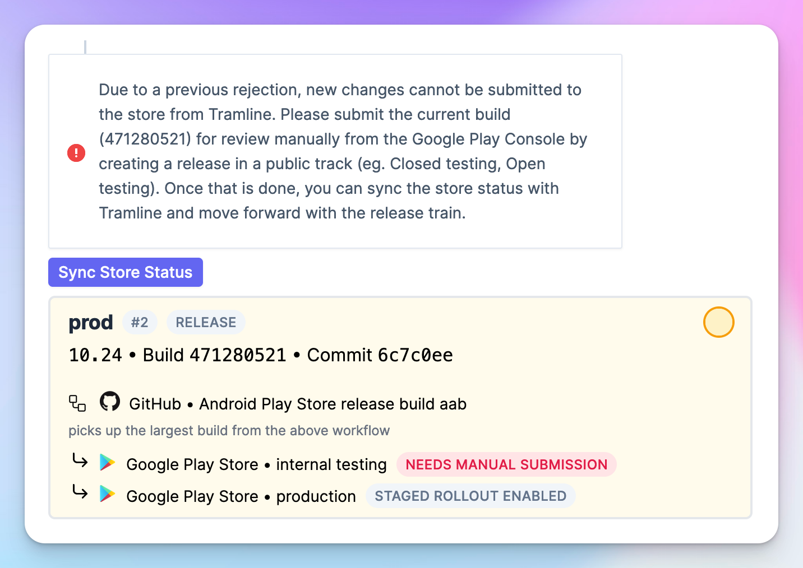
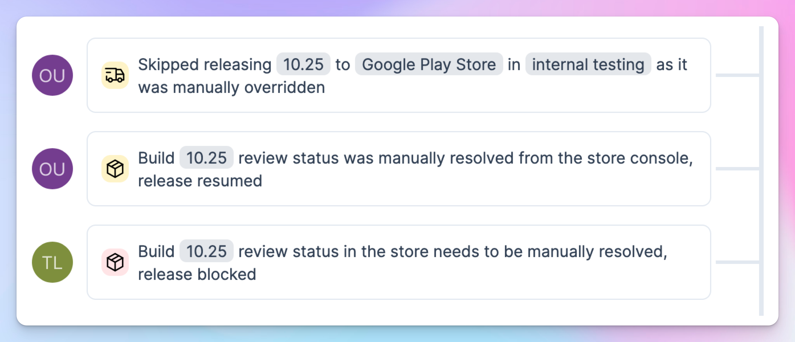

---
mdx:
 format: md
date: 2023-12-21
authors:
  - 'kitallis'
  - 'nid90'
  - 'pratul'
---

# December 21, 2023

### Custom build metadata

There are some metadata around an app build that are, as of now, out of the purview of Tramline. These could be things like Unit Test Coverage, App Launch Time or something else completely custom to your team.
Tramline now allows you to associate these metadata with the builds in Tramline and see the trends during the release.

You can use the API documented [here](https://docs.tramline.app/api#send-custom-metadata-for-a-build) to send these custom build metadata.

In addition to the custom build metadata, Tramline automatically tracks your app size across the RC builds generated in the release.

These trends are not just useful to monitor your build health over time, but they can also help you make go/no-go decisions about your release right here from your release dashboard.

### App review failures

App review failures are the bane of app releases. Tramline now handles app review failures from the stores and allows your to continue with the release process after resolving the issues.

#### iOS

For iOS releases, a review failure can be tackled in a couple of ways – via communication with the review team or by submitting a new build for review.

Tramline now monitors the state of review after a rejection. If the review is resolved by communication, Tramline will sync the status, once the review is approved, and you can continue with the rollout of the build from your Tramline release dashboard.

If, however, you need to submit a new build, simply make a change in your release branch and Tramline will trigger a new build for submission.

Tramline will prepare the new release version, set phased release if configured, upload all the necessary release metadata, and allow you to submit the build from your release dashboard.

#### Android

When an app review fails on the Google Play Store, a new build cannot be sent for review via Tramline due to the [limitations of Google Play Publishing API](https://issuetracker.google.com/issues/179708468#comment13). Tramline will, however, instruct you on what to do right there on the release dashboard.

Once you resolve the issue by submitting the new build for review manually from Console UI, you can sync the status back on Tramline.

Tramline will verify the correct status, sync the changes made on the Console UI, and continue with the release as configured.

### App variants

Tramline now supports App Variants which are akin to product flavors or build variants, but with an explicit requirement of having a different bundle identifier.

For example, you can have a staging variant `com.tramline.ueno.staging` which is different from your primary `com.tramline.ueno` app.

App variants allow you to configure different build distribution endpoints for each of these variants. Eg. different Firebase App Distribution apps for different variants.

When defining a release step, you can now choose the app variant (default being the primary app) and its configuration to be used for the build generation and distribution.

### Custom release version

Tramline automatically manages your release version across your app releases, ensuring that the next release or hotfix always starts with the correct version.

But, there might be times when you need to start the next release with a custom release version. Tramline now allows you to override the default behavior and start a release with a custom release version.

The custom release version goes through the usual validations like correct the SemVer structure and allowed version as per the stores before starting the release.

Improvements and Fixes

- Fix release notes to allow backticks and other special characters allowed by the stores
- Add the missing release activity on stopping a release
- Support aab upload to Firebase App Distribution
- Fix fetching changes since the last release for releases with tagging disabled
- Add the missing deployment failure notification
- Handle attachment upload in progress error from App Store Connect when submitting the build for review
- Change the external link in release health cards to the release-specific dashboard for Bugsnag integration

<!-- truncate -->

