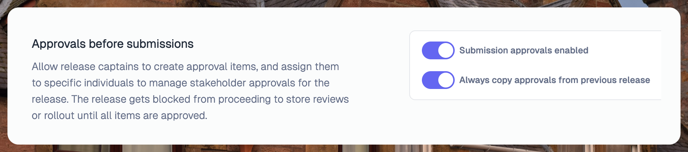
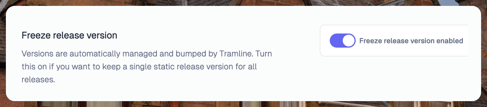

---
mdx:
 format: md
date: 2024-12-30T20:00
authors:
  - 'gurupratap'
  - 'kitallis'
  - 'majjikishore007'
  - 'nid90'
---

# December 30, 2024

  

### Release Health Monitoring – Firebase Crashlytics

Tramline [continously monitors](/using-tramline/quality-and-monitoring/release-health-monitoring) the release health of an app by listening to signals and metrics from dedicated monitoring tools and condensing them down through a release lens. Along with Bugsnag, we now also support Firebase Crashlytics.

This integration works by internally [integrating](/integrations/monitoring/crashlytics) with two tools: Google Analytics and Crashlytics itself.

Crashlytics by itself isn't feasbile for calculating aggregate stats like crash-free rate or adoption rate, because it only contains info on unhealthy sessions; without info on healthy session stats, there is no denominator for crash-free rates or adoption. This denominator is pulled from Google Analytics.

This feature is in beta as we're still collecting feedback and data from our users and will be publically available early next year.

### Copy approvals from previous release

We have extended our [stakeholder approvals](/changelog/november-12-2024#approvals) feature to now automatically copy over approval items from the previous release to the next one. This cuts down work for teams who want a similar set of approval items in each release assigned to a bunch of different people.

Even if you don't have the automatic setting on, you can still copy them over from a single click after the release starts.

### Combine commits in a single push in patch PRs

  

When creating [patch PRs](/changelog/september-8-2023#continuously-backmerge) (for continuous backmerges), Tramline now combines all the commits from a single git push (to the release branch) in a single pull request. This reduces the number of changes that need to be reviewed and merged, and cuts down on general PR noise.

### Auto-retry merge failures for pull requests

  

For all kinds of pull requests in Tramline, namely:

- Pre-release pull requests (before release starts)
- Continuous backmerge pull requests or "patch PRs" (release ongoing PRs)
- Post-release pull requests (after release is completed)

Whenever Tramline creates these, we always try to merge them right after. Apart from merge-conflict related reasons, we are often unable to merge because of various pre-merge checks. For some VCS integrations (like GitHub), we handle this gracefully by enabling post-check auto-merges. But in cases where that's not possible, Tramline now continously tries to merge until checks pass. So if there's a human or bot dependency that's blocking the merge from immediately happening, the merge from our side is still largely hands-free.

For conflict related errors, Tramline clearly marks those PRs on the dashboard as such so that they can be manually resolved.

### Allow fixed build version for releases

This is useful for non-production / nightly releases where you don't care about the actual version name (like 1.2.3), you just need to generate and distribute new builds. Turning this on will fix the version name across all releases for a train. Note that this does not affect the version codes, they get bumped normally as expected.

Improvements and Fixes

- Add rollout percentage to store version APIs
- Remove all previous code from before a major Tramline rehaul
- Run specs on docker
- Improve page titles
- Allow upcoming releases to start when rollouts are paused in the current
- Handle CRLF/LF in release notes consistently
- Paginate Bitbucket APIs when listing repos
- Handle lack of millisecond-precision for multi-commit git pushes

<!-- truncate -->

