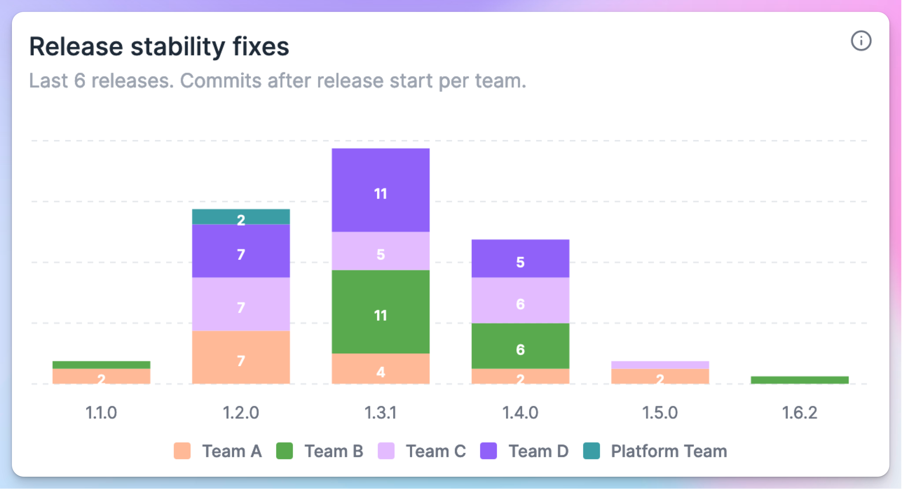
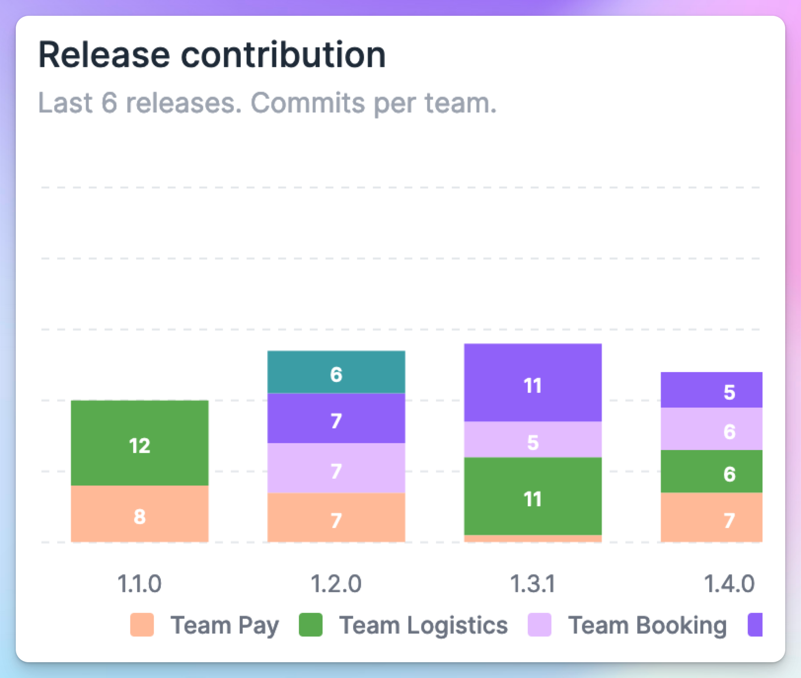
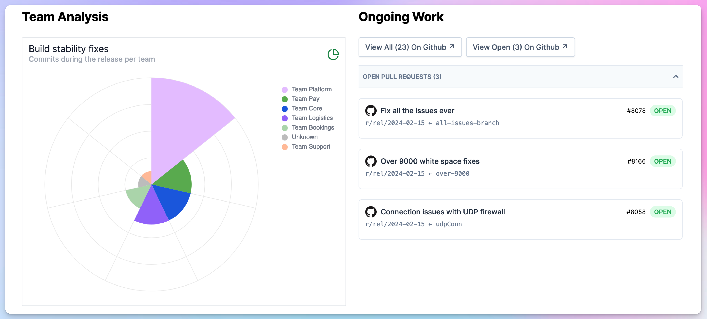
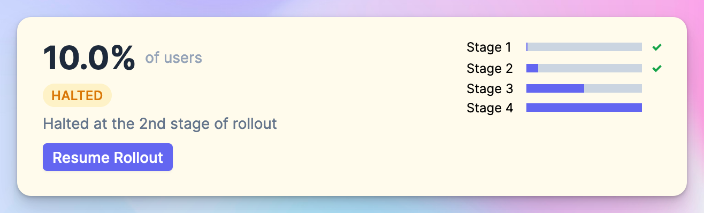
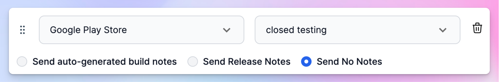

---
mdx:
 format: md
date: 2024-02-29
authors:
  - 'kitallis'
  - 'nid90'
  - 'pratul'
---

# February 29, 2024

### Team-level analysis

Tramline, now supports adding your organization's team structure to the platform. This opens up a lot of possiblity around correlating team performance metrics with release dynamics.

We're kicking things off with release stability & contribution analysis across teams.

What, or rather, who is holding up your releases? We break down which team has contributed the most to the stability of releases.

The flip side of this analysis is equally interesting. Instead of who is holding things up, you get rough indicators on who is contributing the most to a release.

Since this data is also available in real-time for ongoing releases, it complements the insights provided in the [Ongoing Work](https://docs.tramline.app/changelog#mid-release-pull-requests) section. Release managers now get a pretty good sense of what (and who) is holding up the release from moving ahead.

This is one of our first organizational performance-related features, and we're very excited to see what more we can do in this direction :rocket:

### Resume a halted rollout

Previously, halting a staged rollout on Play Store through Tramline meant that your release was essentially **stopped**. But now halting a rollout can be **undone** and you can resume the next stages of your rollout. This behaviour is now in parity with what the Play Store Console allows you to do.

### More customizations for tester notes

Backed by popular demand, we now support [even more](https://docs.tramline.app/changelog#optionally-select-auto-generated-build-notes) loaded configuration options around distributing build notes. For every distribution channel you select, you can now pick out of any of the three choices:

1. Send auto-generated notes from Tramline
2. Custom release notes
3. No notes

Improvements and Fixes

- Add additional commit info to the step failure notification
- Add automatic retries when fetching artifacts from GitHub workflows
- API to fetch releases for a branch now accounts for multiple releases
- Bump version only when new changes have come since the last submission

<!-- truncate -->

