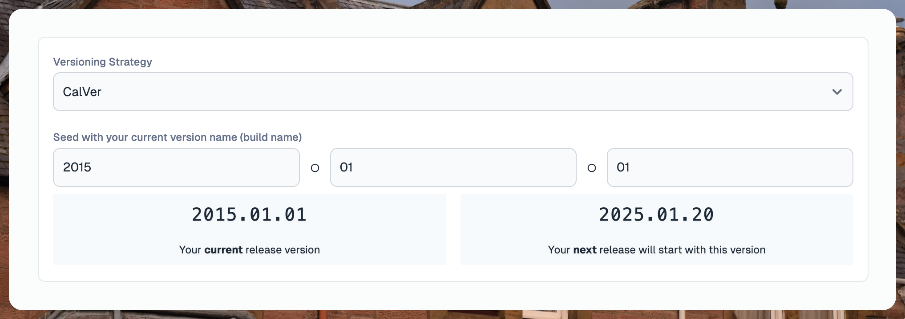
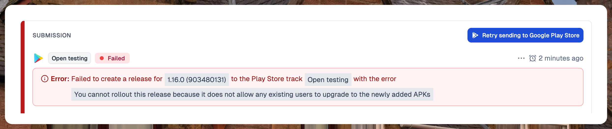
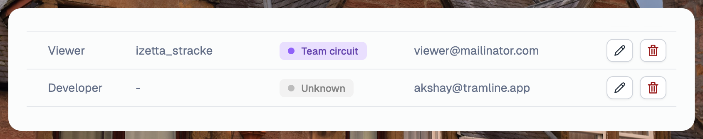

---
mdx:
 format: md
date: 2025-01-20T20:00
authors:
  - 'kitallis'
  - 'nid90'
  - 'samrat'
  - 'shhivam'
---

# January 20, 2025

<p>
  
</p>

### CalVer 📅

In addition to a SemVer-like versioning scheme, we now also support a calendar-based versioning scheme. Stores (both Apple and Google) don't particularly support one scheme or another, and neither are they very particular about the adherence to a [spec](https://semver.org). App Store, for example, suggests a roughly SemVer-like format for build versions and Google Play Store is pretty free-form.

Since Tramline automatically manages versions for you, we categorize them into specific versioning schemes so that the increments are predictable.

For example, In SemVer, we allow the following versions:

✅ Allowed
```
1.2.0
4.2.1
16.9
```

❌ Invalid
```
1
1.2.3.4
1.02
```

With **CalVer**, we use the following scheme:

```
YYYY.0M.0D0N

YYYY = Full-year
0D = Zero-padded day
0M = Zero-padded month
0N = Zero-padded sequence number
```

✅ Allowed

```
2025.01.20
2022.02.01
```

❌ Invalid

```
25.1.20
25.1.32
2025.1.1
```



The sequence numbers are used to track patch updates. For example, if you start rollout on `2025.01.20` to the store, but you add a patch update before it completes, the next version will be `2025.01.2001`.

### Manual retries for submissions 🔁



We now **finally** support retrying failed submission for any submission channel. This is a highly requested feature, but due to the complexity of tracking resumability of different submission states, we delayed it until we got it right. For most known issues or one-off errors, we already internally retry. But now it should be possible to manually retry issues that escape our internal error handling or automatic retries.

### Build suffixes for Android builds 🪜

<p>
  
</p>

When configuring submissions, you can now add a suffix to the version name that is assigned to the build. This is useful for segregating build versions (and release names) clearly in different submissions channels like Firebase / Play Store.

For example, if you setup a suffix `staging`, the version name will become `1.0.0-staging`.

### Archiving team members and invites 🗑️



Previously, owners could only edit roles of team members, now they can also remove them. When users are removed, they are soft-deleted or archived and not actually deleted from the system. This is why we avoid the terminology of _delete_. Pending invites, however, are permanently deleted.

For SSO users, removing a user does not revoke their SSO access from the IdP (identity provider), which means they can always log back in as a viewer. On the flip side, if they are removed from the IdP, they aren't automatically kicked out from Tramline, however, they naturally won't be able to login (and can be cleaned up from Tramline if necessary).

<details open>
<summary>Improvements and Fixes</summary>

- Fix bug that disallowed role change for SSO users
- Allow automatic scheduled releases to start upcoming releases
- Show a snapshot of recent events in pre-prod releases
- Finalizing a release should only check for PRs created by Tramline

</details>


<!-- truncate -->

