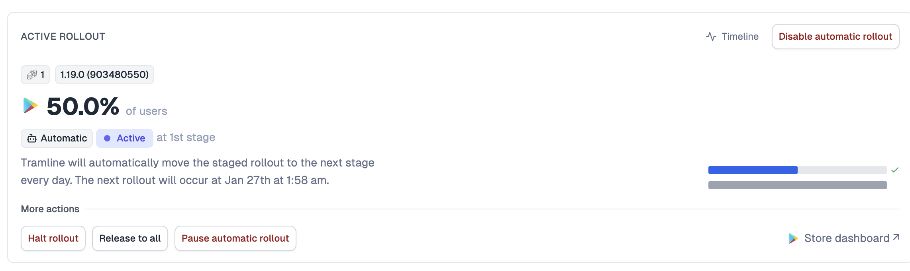
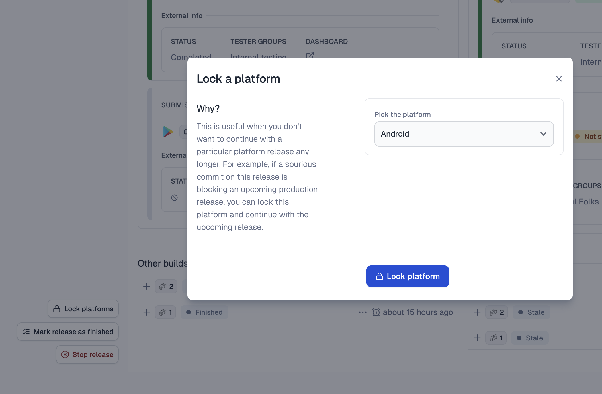
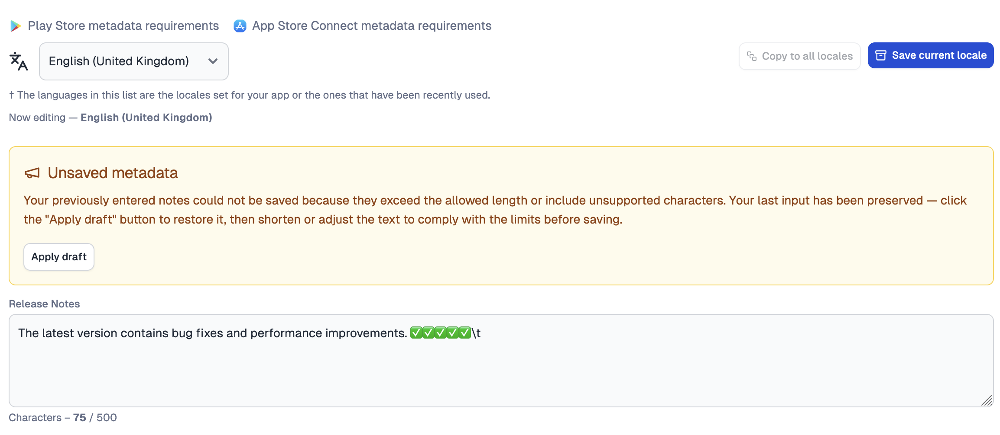

---
mdx:
 format: md
date: 2026-01-30
authors:
  - 'Animesh-Ghosh'
  - 'kitallis'
  - 'nid90'
---

# January 30, 2026

### Smart staged rollouts

Tramline can now automatically progress your **Android** staged rollout. When enabled, the rollout advances to the next configured stage once every 24 hours, as long as the release remains healthy. If [release health rules](/using-tramline/quality-and-monitoring/release-health-monitoring) detect problems, the rollout is automatically paused. You can manually pause, resume, or switch back to manual control at any time.

Read more about configuring automatic rollouts → [here](/using-tramline/release-management/release-settings#automatic-rollout)

### Auto-start rollouts after submission

Production rollouts can now start automatically without manual intervention. On iOS, enabling this sets the release type to "After Approval" in App Store Connect — once Apple approves the review, the release begins on its own. On Android, the rollout kicks off as soon as submission preparation completes.

Read more about auto-start rollouts → [here](/using-tramline/release-management/release-settings#auto-start-rollout-after-submission)

### Form-factor support (Android only)

  

You can now target Android releases to specific device form factors — Wear OS, Android TV, Automotive, and Android XR. These can be configured both on production and internal submissions.

  

Note that we currently don't support a hybrid release of separate form-factor tracks to **production** from the same release train. We recommend creating separate trains or apps for this. Separate tracks for Internal/Beta submissions are however supported in a hybrid way.

### Auto-update inflight release with latest RC

When a new release candidate build is generated while a production release is still awaiting review, Tramline now automatically swaps in the latest build and re-prepares the submission. This keeps your in-flight release current without manual intervention.

### Lock platforms

For [synchronized releases](/using-tramline/release-management/synchronized-release), you can now lock individual platforms to mark them as complete independently. This unblocks upcoming releases for that platform without waiting for the other platform to finish. Critical fixes can still be applied after locking.

Read more about locking platforms → [here](/using-tramline/release-management/suspending-releases#locking-platforms)

### Draft release notes

Release notes and other text metadata (like iOS promo text) that don't meet store validation requirements are now saved as a draft. You can re-apply, edit and save them as needed.

Improvements and Fixes

- Don't create version bump PRs for hotfix releases
- Make scheduled releases DST-insensitive (rely on time-of-day)
- Review-rejected builds can now be resbumitted
- Limit production blocking checks to active releases only
- If git tagging fails, do not block further operations

<!-- truncate -->

