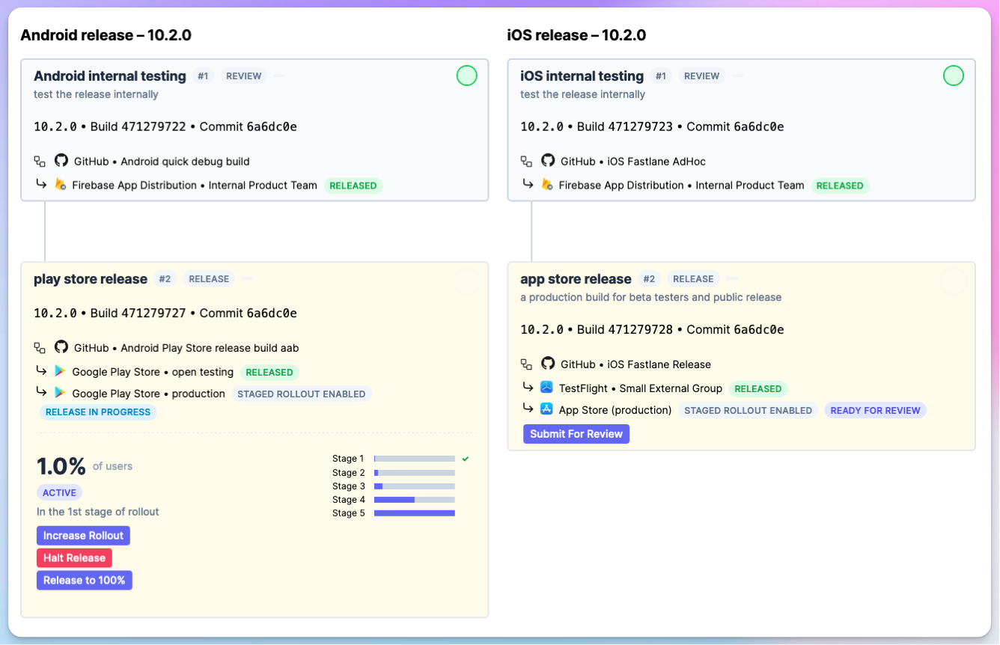
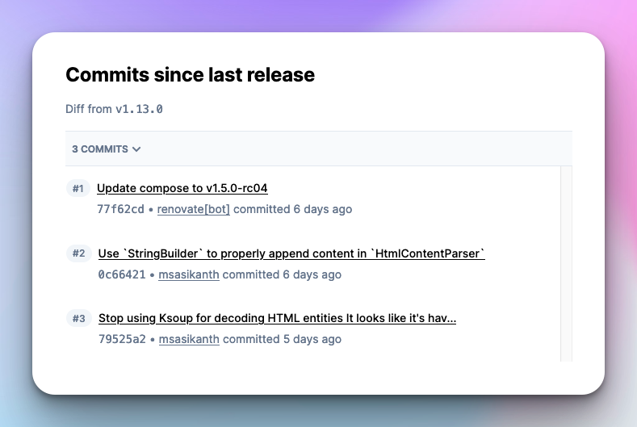
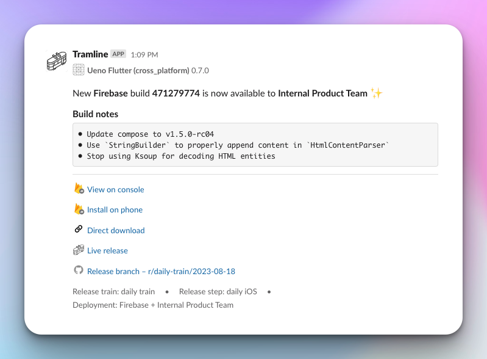

# July 27, 2023

### Synchronized releases for cross-platform apps

For teams with apps built in cross-platform stacks like [React Native](https://reactnative.dev/) and [Flutter](https://flutter.dev/), we now support synchronized release trains across both platforms.

- This allows teams to run their releases from a single branch.
- You get centralized control over both the stores.
- This also ensures all changes get applied to both platforms, but also gives you the nuance to apply selective changes to either platform when needed.

Since there can be cases where there is a drift between what is shipped to one store over another, we also cut platform-specific tags to disambiguate the commits.

### Changes since last release

The changes in your app since the last release are now visible on the live release page to provide context on what all is getting shipped in the current release.

### Build notes

Well-formed, sanitized commit messages since the last good build are now available as test notes in Slack, Firebase App Distribution and TestFlight.

Improvements and Fixes

- Release suffixes are now optional for steps
- We now fetch latest build numbers from stores to reduce probability of version clashes
- Previous running steps are cancelled (both in Tramline and in CI) when a new commit lands
- All non-production deployments are now triggered automatically to allow fully automated releases (this paves way for automatic scheduled releases!)

