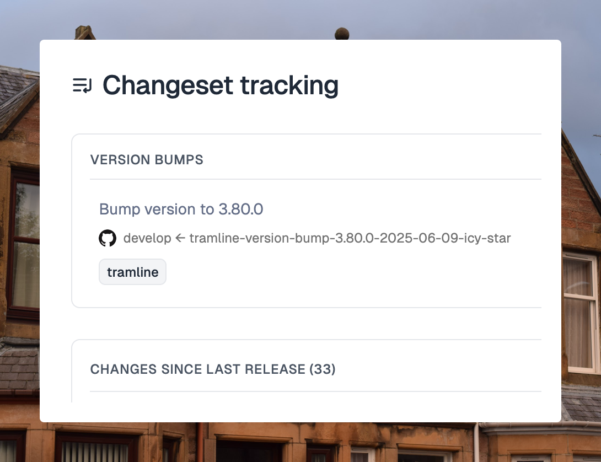
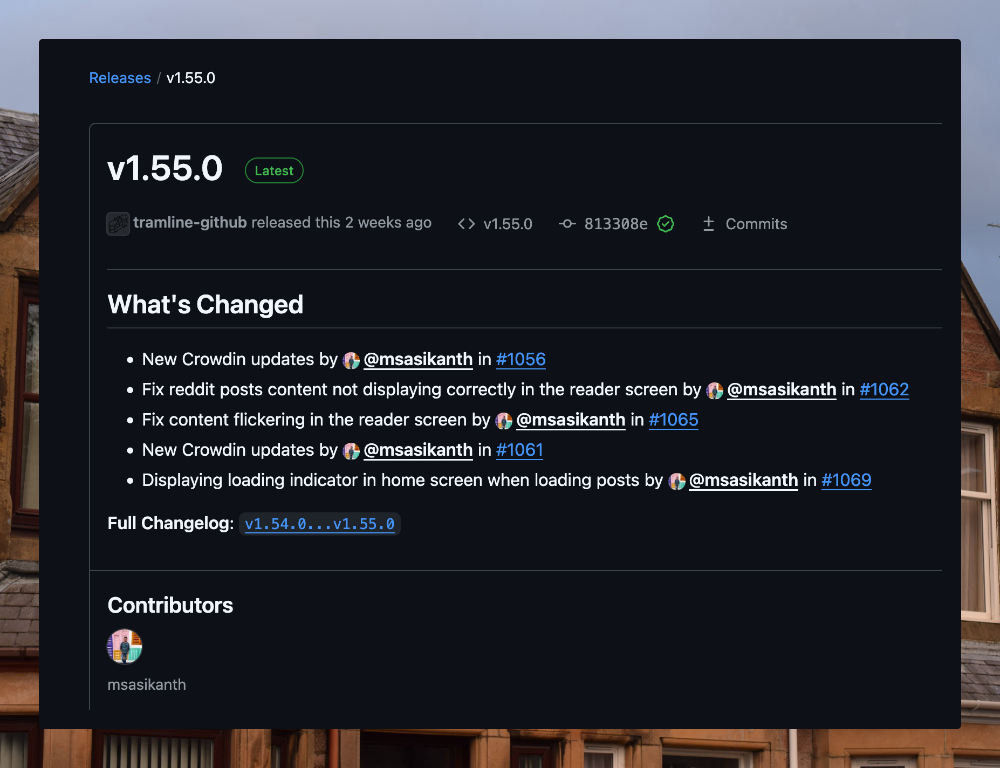

# June 11, 2025

### Automatic version bumps

Up until now, to manage build coordinates (version name, build number) Tramline would send over the right values to the triggered workflows so that the correct build could be generated; this ensures that Tramline is always the source of truth for version management.

However, this system has a limitation. It makes tracking the versions in the source a bit hard. One either has to write the version names manually to the build files like `build.gradle`, `pubspec.yaml` etc or maintain a script that reads the values sent by Tramline and then run some script to do it.

Tramline now introduces two version bumping strategies that automatically create a PR to write the versioning info against some supported build files.

1. Current version (to working branch) before release branch is cut
2. Next version (to working branch) after the release branch is cut

The following build files are currently supported:

- `build.gradle` (gradle)
- `build.gradle.kts` (gradle with Kotlin)
- `plist` (for iOS)
- `pbxproj` (for iOS)
- `pubspec.yaml` (for flutter)

We will continue to extend this feature to add support for more file types, custom versioning files and more granular strategies in the future.

### Branch prefixes

Quick quality-of-life improvement, you can now add prefixes to some of the automatic branches we create from Tramline. `<prefix>-version-bump` or `<prefix>-patch-main`. Note that prefix or any branch name modification is not supported for the release branches themselves currently.

### Fixing Releases on GitHub

For GitHub VCS integrations, when we cut tags related to the releases, we also allow creating GitHub Releases against them. Previously, this experience was sort of broken because the GitHub API to create tags with releases is unreliable. It often internally blows up if the changelog for the release is too big (to workaround this, we would send Tramline's own copy of the changelog). Secondly, it also isn't very predictable in terms of the two tags it picks for the changes. Sometimes the previous tag picked is arbitrarily quite far back in time.

We've fixed these longstanding issues and now always generate the correct changelog between the correct tags and retain the formatting style of the changelogs from GitHub.

Improvements and Fixes

- Hide previous releases paginator if there are too few releases to show
- Add confirmation message before refreshing Slack channels
- Allow resubmitting the same iOS build again
- Show search results in reverse chronological order

