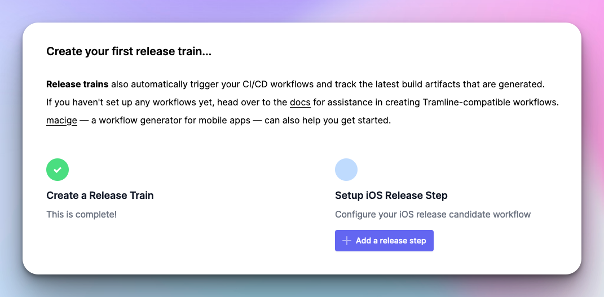
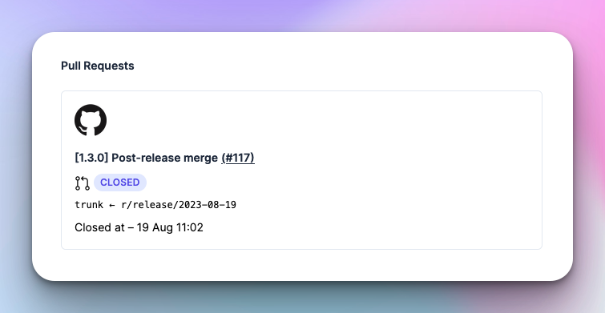

# June 3, 2023

### Train setup wizard

We know how setting up the integrations and release trains can be a bit tricky to navigate. So we now have a quick wizard that helps you get started on your very first release train.

### Automatic finalization

We have couple of enhacements towards the end of a release.

1. Tramline automatically starts wrapping up the release and starts the finalization process (cutting tags, creating PRs, locking the release etc.) as soon as the release step finishes.
2. For the Almost Trunk branching strategy, we create and merge a PR at the end to get all your release branch fixes back to the working branch.

### Versioning changes

We now support a partial SemVer scheme like `MAJOR.MINOR` along with `MAJOR.MINOR.PATCH`. Additionally, Tramline used to bump up versions for every commit that would land on the release branch. This has now changed to bump up versions (either minor or patch, depending on your strategy) **only** during hotfixes, i.e. commits that are landed during a production rollout.

Improvements and Fixes

- Show details about your integration in the integrations page (bundle id, connection info, project info etc.)
- Add an option to manually refresh Slack channels, in case the list is stale

