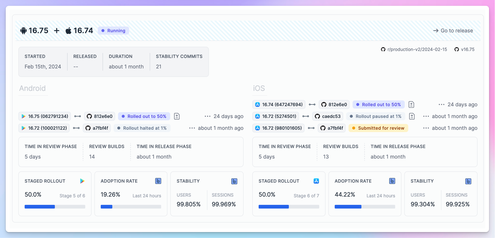
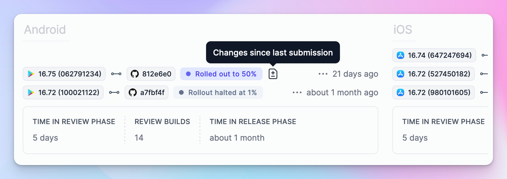
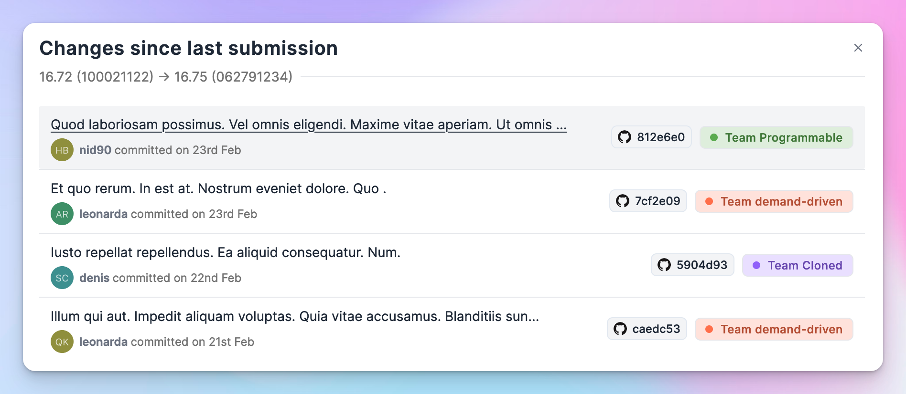
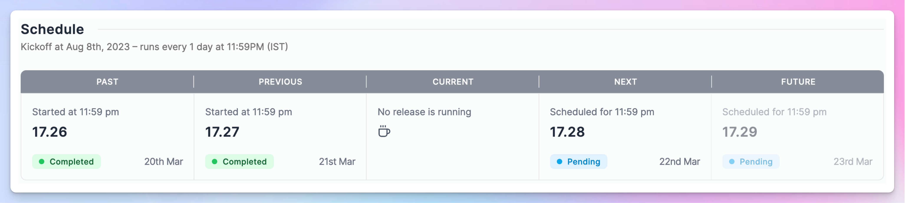
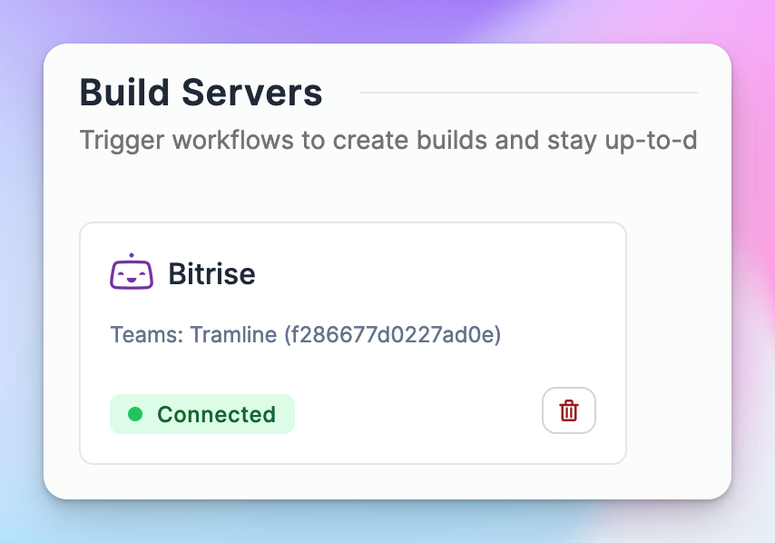

# March 25, 2024

### Introducing a design system

Over the past few months, we've been steadily improving our user experience and we've now rolled out a new version of our interface to all users 🚀

Tramline is an interaction-heavy, information-dense, multi-stakeholder system with entirely novel abstractions. Keeping that in mind, our decisions, in summary, were guided by the following principles:

1. A design system with as *few* foundational components as possible
2. Minimal navigational overhead containing users into only two "work" related pages
3. Well-defined color palette, but with judicious use of colors
4. Consistent typography, iconography, borders and spaces
5. Configuration forms serving both as inputs and information guides
6. Tabs with lazy loaded content wherever multi-page navigation is required
7. Liberal use of modals for smaller forms, and infrequent interactions
8. Smaller font sizes and denser layouts, with liberal use of tooltips for explanations

For the last year or so, our UI has been accretive, organic, repetitive and as a result: all over the place. This is an attempt to take a step back, collect all the feedback and visually reorganize Tramline from the ground up.

<figure width="100%" height="100%" style={{padding: '0.5em', border: '1px solid #ccc'}}>
  <video width="100%" height="90%" style={{padding: '0.2em 0.2em'}} autoPlay loop controls>
    <source src="/img/changelog/new-ui.webm" type="video/webm"></source>
    Unsupported Browser
  </video>
  <figcaption style={{fontSize: '12px', fontStyle: 'italic'}}>Tramline previously, to now.</figcaption>
</figure>

Tramline's engineering is just a couple of folks (just one for the first half!), so we were able to go a long way without a proper system in place. But since a lot of our engineering principles have reached solid state, we felt the design needed to do the same so that we can continue to ship really fast.

The new system hasn't taken over the entire application yet, but we are planning to ship all of it in the next couple of months.

Stay tuned for an in-depth post on our [blog](https://www.tramline.app/blog) where we'll dive into the details!

### Changes between store versions

All builds or versions making their way to the store are prominently featured on the new releases page (formerly known as the Train page). These store versions are now accompanied by a "diff" button, allowing one to easily compare the changes between the current build and the previous build sent to the store within the same release.

Sometimes bug fixes during a rollout are unavoidable, and when it does happen, it's helpful to know precisely what changed between them. This changeset of course also naturally ties your changes (commits) with the specific teams, if teams are configured.

### Scheduled release view

We've added a small dynamic widget that displays both the recent history and upcoming runtime of a scheduled release train. This view adapts according to the schedule set. Think of it as a compact, calendar-style glance into the scheduling status and an indication of when the next release is scheduled to occur.

### Disconnect integrations

This has been a long while coming, but now you can disconnect integrations! It's historically been a low priority for two reasons:

1. Once connected, you seldom need to change your core integrations
2. Changing an integration should not destroy historical release information and state connected to the previous integration

We built a simple internal versioning system for our release related data which now enables us to disconnect and reconnect integration without disturbing any prior state.

In the future, we can port over a similar idea to allow changing distribution channels and step re-ordering as well.

Improvements and Fixes

- Allow selecting a color when creating a new team
- On the team page, show the inviter for a user
- Identify the `tramline[bot]` in the Team Analysis charts and remove other bots
- Allow configuring the release stages for the Bugsnag integration
- Fix the order of versions in the charts (on the x-axis) when there is missing data

