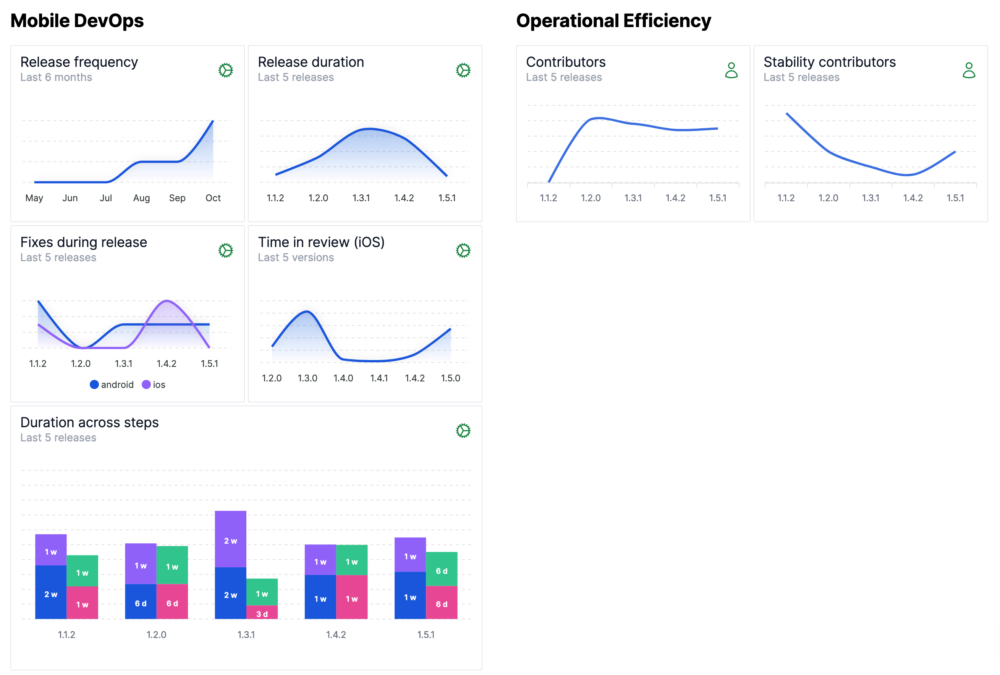
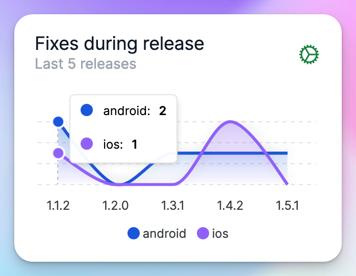
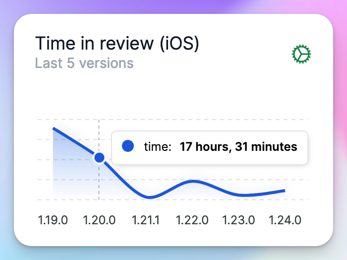
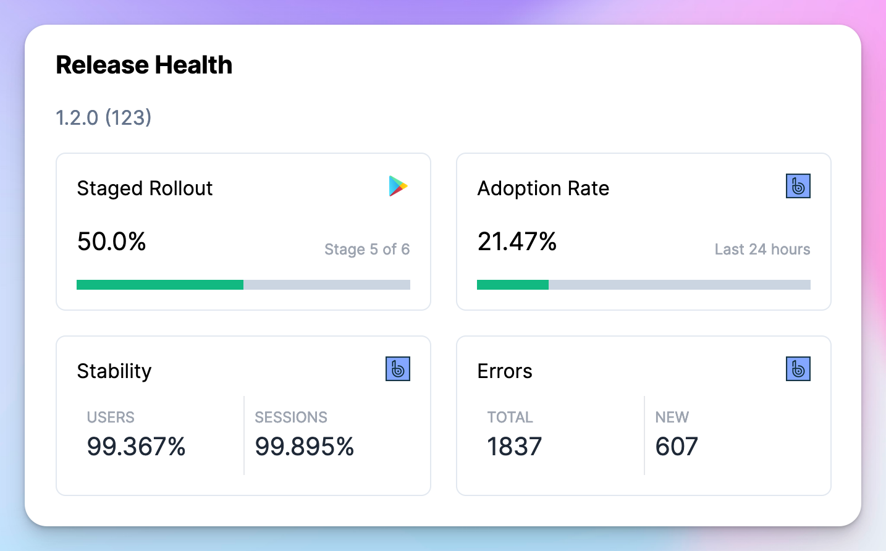

# November 1, 2023

### Release Overview

We now generate a high-level view of aggregated statistics across your releases. You can use these metrics to draw insights on the overall health of your release process.

This includes important [DORA](https://dora.dev/research/) metrics like Release Frequency and Fixes During Release (number of store versions generated).

Other key metrics tracked are:

- Release duration
- Time spent by your team in various steps of the release process
- Contributors to the release
- Contributors towards the stability of the release

In addition to the above, you can see how your iOS build review time from the store trends over time.

### Release Health Monitoring

We have added a new category of integration in Tramline: Monitoring and Analytics.

By connecting your error and metric tracking system, you can now monitor release metrics and stability right from your ongoing release page to make correct decisions about your release rollout.

We currently support [Bugsnag](https://bugsnag.com/) only, but more integrations are coming soon.

### More Train Configurations

We have added two more configurations to your release train:

- If your CI workflow generates multiple artifacts, you can now provide a name to choose the correct build artifact (aab/apk/ipa) among the files generated. When left blank, Tramline will choose the largest file generated as the build artifact.
- You can now optionally add a suffix to the tags generated at the end of the release. This feature can be used for distinguishing, say, nightly release tags from standard release tags.

These can be set in the train **Settings** page.

Improvements and Fixes

- Handle degraded AppStore Connect APIs gracefully
- Fix all builds page to be accessible by viewers
- Fix scheduled release notification to show the correct release version
- Override manual trigger config for a single step train
- Do not finish deployment run when staged rollout is halted
- Restrict uninvited signups from configured domains (enabled on request from customer)

