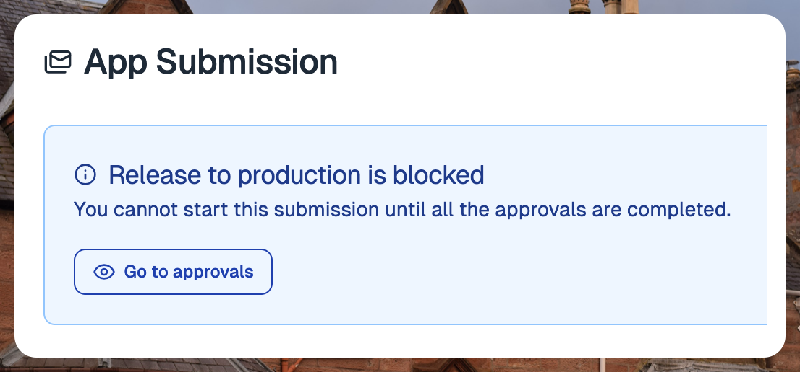
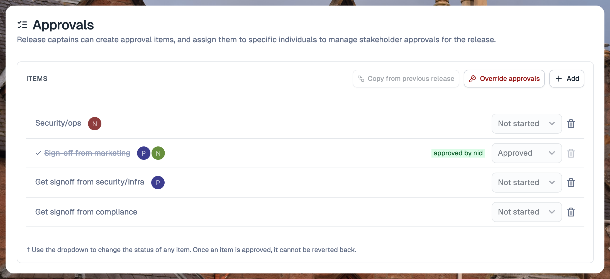
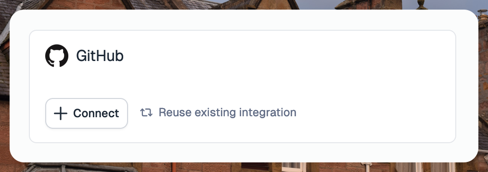

---
mdx:
 format: md
date: 2024-11-12
authors:
  - 'kitallis'
  - 'nid90'
---

# November 12, 2024

### Approvals

Tramline now has an approvals system that allows you to add high-level approvals from various stakeholders for the release.

During a release, the release captain can add tasks to be approved by any set of members in the team. When a task is assigned to a team member, they receive an email notification.

The assignees of the task can mark the task as approved, blocked, or in-progress. The release cannot be sent to the production track on the stores until all the approvals are complete.

The release captain can choose to override the approvals for a release. This is useful for rare scenarios where there is an urgency in getting the release to production and the team members are unavailable for the required approvals.

If the override is used, it will be reflected on the release activity page for auditing purposes.

The configuration to enable approvals for the release can be found in the **Advanced Settings** of the release.

### Edit roles of team members

You can now edit the roles of your team members in the team section of the **Organization Settings** page.

The owners and developers in the team can edit the roles of the developers and viewers, respectively.

This is especially useful for teams with SSO enabled. With SSO, any member of your organization can log in to Tramline as a viewer. You can choose to change the role of the user to the most appropriate one once they have joined your team in Tramline.

### Re-use the same integration for multiple categories

You can now re-use the same integration for multiple categories. This reduces the number of connections required for onboarding a new app.

Improvements and Fixes

- Enhance FAD build upload check to search by build number and version name
- Auto-detect file extension for build archive files when not provided
- Send branch context to Bitbucket when triggering pipeline for commit
- Ensure submissions get picked up in the correct order
- Set the app time zone correctly on the live release pages
- Fix default production submission config for Android
- Fix resume action for app store rollout
- Handle a phased rollout on the App Store when it's already complete
- Pick active locales only from the production track for Play Store
- Fix "changes since previous" to handle unapplied commits
- Add missing locale string for rollout getting updated
- Add a warning to show until which release step the notes can be edited
- Fix health metric jobs to stop fetching after the monitoring period

<!-- truncate -->

