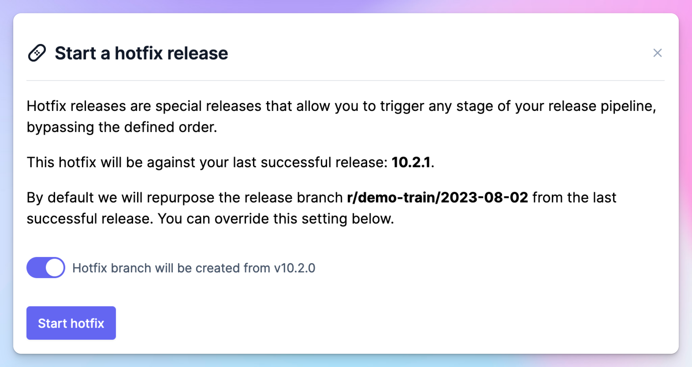

# November 16, 2023

### Hotfix Releases 🤕

Most people want to avoid hotfixes entirely, but when push comes to shove, you don't want your regular release processes to become shackles. 

This is where hotfix releases come in. By starting a hotfix release, Tramline will:

- Predict the correct version to be hotfixed
- Initiate a hotfix from a previously completed release branch
- Optionally, initiate a hotfix from a tag, creating a new hotfix branch on top

Importantly, you can quickly deploy a hotfix release because these releases are special. They allow you to bypass the defined step order, skipping the review steps and going straight to production.

For [synchronized releases](/changelog/july-27-2023#synchronized-releases-for-cross-platform-apps), as is often the case, hotfixes also support releasing only to a single platform to avoid spending time on manually skipping the other platform.

#### Caveat

Stores can only have a **single** live build, which means penultimate releases can be hotfixed as long as the latest release hasn't started rolling out. 

In essence, hotfixes are a _conceptual_ abstraction. You are creating a new release instead of directly fixing the previous one, which might still be live.

It's an abstraction of a process that is manually carried out, and Tramline offers this as an atomic package where the details aren't important to know.

### Rollouts + Adoption 📈

Because Tramline simultaneously controls **phased rollouts** and tracks **adoption**, we can now uniquely correlate the two things in a single graph. This is something that would've previously been very tricky to automatically do.

This feature is available once you connect a **Monitoring and Analytics** integration like Bugsnag and start a production release.

### Partially Finished Releases 🥑

For [synchronized releases](/changelog/july-27-2023#synchronized-releases-for-cross-platform-apps), if you decide against releasing to both platforms, you can now belatedly mark one platform as finished. This allows the release to proceed without the need to restart the entire release or pause the other platform.

Improvements and Fixes

- Handle the rare "startup failure" error from GitHub Actions
- Handle Firebase (App Distribution) degradation gracefully
- Changelogs can now optionally pick up only the merge commits for summary, instead of all commits between releases
- Show the commit application time for the release (along with the commit authoring time)

