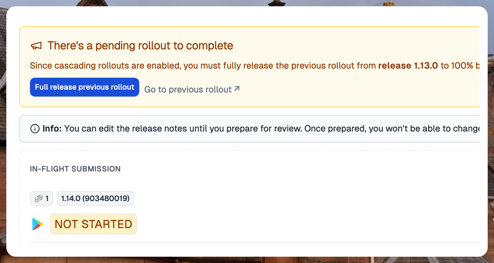
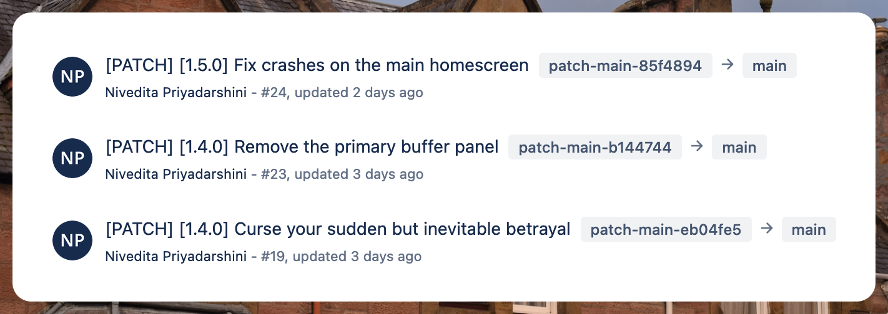

---
mdx:
 format: md
date: 2024-11-27
authors:
  - 'kitallis'
  - 'nid90'
---

# November 27, 2024

### Cascading rollouts

With Google Play Console, when you update your rollout to a 100%, it is not possible to halt it, even if in reality the actual rollout hasn't farmed out to all of the 100% of users yet.

For example, if you have 100 users, and your rollout sequence is 10%, 50% and 100%, and once you actually move the rollout to 100%, it is possible that number of users/sessions that actually receive the update is still much less than 100. Since a halt isn't possible on the Play Console at 100%, teams usually have a workaround to release to 99.9%. This allows them to halt the rollout until as late as possible.

Tramline now natively supports this process; you can set your rollouts to be **cascading**, which will only rollout to 99.9% (or your final rollout value of choice) and _prevent_ you from starting the rollout of the next release until the previous one is moved from 99.9% to a 100%.

This entire flow is managed and prompted through appropriate callouts and actions during the release process.

### Continuous backmerges without cherry-picks

every commit. However, this method is unfortunately integration-specific, as not all VCS providers support cherry-picking through APIs.

Specifically, Bitbucket doesn't support cherry-picks or even mimicking a cherry-pick, so we do the following:

- Create new patch branches, like `patch-main-afddfcd` from the release branch for every new commit
- Try and merge the patch branches to the `main` (working branch) via a pull request

In this mode, subsequent patch branches could have more than one commit, if the previous ones are unmerged. So we recommend merging everything as soon as possible and in the correct order to avoid confusion.

### Re-fetch workflow status

  

Until now, Tramline allowed you to re-trigger workflows if there was a failure in the runs. Now, additionally, you can simply re-fetch the status of the workflow run instead of retriggering. This is especially helpful when you don't want to retrigger the entire workflow but can just re-run the specific failed jobs and have them sync on Tramline.

Improvements and Fixes

- Stricter validation for release notes for each platform
- Submission configuration is now optional for internal testing
- Do not auto-stop a scheduled release on post-release failure
- Do not allow -ve values in reldex computation
- Allow a different set of supported languages for Android and iOS
- Truncate commit messages in notifications to adhere to Slack limits
- Notifications around internal submissions finishing
- Generally nicer cues for showing progress in live release
- Optimize load times for the Release Activity page

<!-- truncate -->

