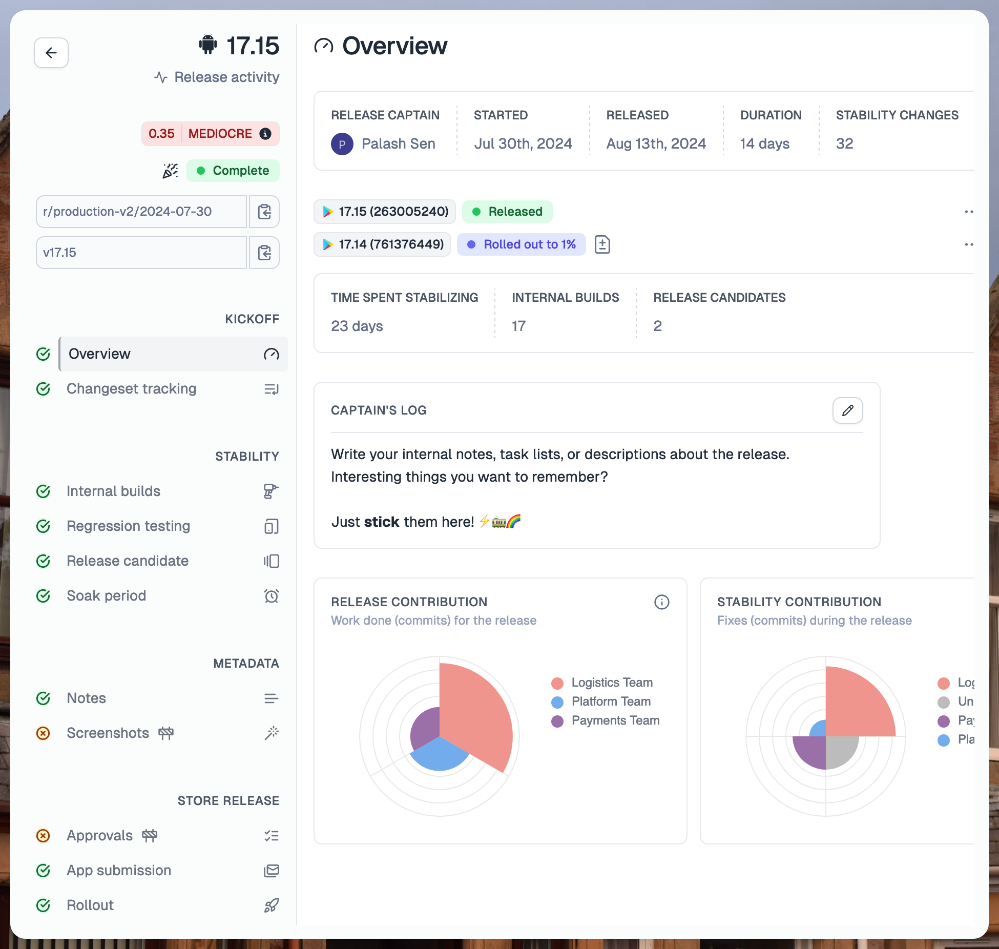

---
mdx:
 format: md
date: 2024-10-13T20:00
authors:
  - 'kitallis'
  - 'nid90'
---

# October 13, 2024

### The work pane (live release page)

Tramline is conceptually a relatively rare paradigm of DevTools. Other "release management" DevTools on the server-side like Heroku can operate more or less solely through a CLI. For most teams, Tramline is a high-touch tool where a lot of people end up collaborating. It is as much a GitHub as it is a Heroku.

This is why a more-than-default thoughtful design is necessary for Tramline. It is important so that people can get used to the "right flow" for releasing apps.

From this lens, we've made two broad changes.

1. Porting our [design](/changelog/march-25-2024) over to the "work pane"
2. Simplifying the building blocks for configuring a release

#### Layout & design

The work pane is auto-structured into four main sections:

<ins>Overview:</ins> Issue tracking, changeset tracking and the homepage for the Release Captain.

<ins>Stability:</ins> Internal builds, Release Candidates, testing.

<ins>Metadata:</ins> Dedicated space for updating notes, store metadata and screenshots.

<ins>Store Release:</ins> Managing reviews and rolling out to production.

Previously, the work pane was one giant page, and even though there's some value in everything in one single page; it is a nightmare of information architecture and page load times. More specifically, categorizing them allows us to clearly differentiate historical state, present state and future state across different events.

#### Improved UX around app submission

Because the design allows for more breathing room, we can focus on individual aspects of the release a bit better.

For example, there's a lot more control around app submission. You can cancel a running review in progress and you can also replace the build for an existing review with a new one or a previous valid one.

  

Similarly when rolling out, the entire page doesn't get filled with a lot of rollout data, there's a dedicated place for it:

  

#### Not just tabs

  

The tabs are alive — they always track the current state of that section — whether it's in progress, completed or pending. They also automatically get switched over to the most important tab in the current release and they disappear if they aren't necessary to the current release.

#### Configuring the release

We have now thrown away all the bloated abstractionware of *Steps* and *Deployments* and instead we just deal with **Submissions**. The interface to configure them is a single pane to setup everything about your release and will continue to grow down this path.

Trying to be clever with our release abstractions and modeling them after CI/CD pipelines was a mistake. We now model things around actual user patterns.

### Support for multi-locale release metadata

We now also support updating multiple languages for the release notes. When you start your release we pick up your last updated release notes, which you can edit before release.

On top of this, we also support updating multiple languages for both iOS and Android (for cross-platform apps) from the same place!

### Remove Slack as a submission integration

Slack was previously available as a submission integration so that you could send builds to a channel. This is [still supported](/changelog/april-22-2024#attach-builds-with-slack-notifications), but as a part of the notification configuration itself.

We've been [wanting to make this change](https://github.com/tramlinehq/tramline/issues/448) for a bit because it makes the purpose of each category very clear. Integrations that distribute should be integrations where the primary purpose is to distribute, it's not enough that they can optionally help distribute. Slack is foremost a team chat tool, and file server later.

This is only applicable to new apps, existing apps with Slack as a submission integration will be gracefully ported over.

### App Variants with their own integrations

Late last year, we added support for adding multiple bundle identifiers within a single primary app [under App Variants](/changelog/december-21-2023#app-variants). This helps support flavors of the same app being distributed to different submission channels. We've gone a step further, and allow configuring a different account/integration altogether rather than just using the existing primary app integrations.

:::note

App Variants still only support Firebase App Distribution at the moment. We will be adding more integrations in the future.

:::

Improvements and Fixes

- Ensure all API-call based user actions are async
- Fix UI issue around showing 100% rollout correctly for non-staged rollouts
- Ensure there are valid build workflows available before allowing train creation
- Fix the password reveal toggle in the signup form
- Show a generic flash message instead of a full 500 page
- GitHub release notes are now well formatted and respect automatic notes
- Dockerize the entire dev setup

<!-- truncate -->

