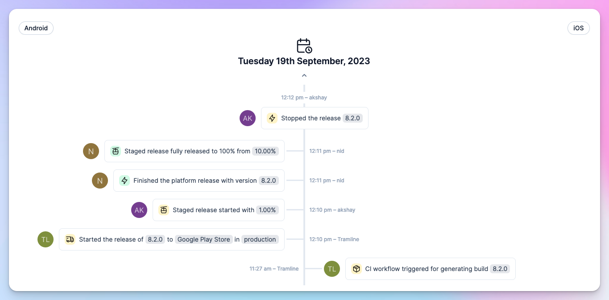
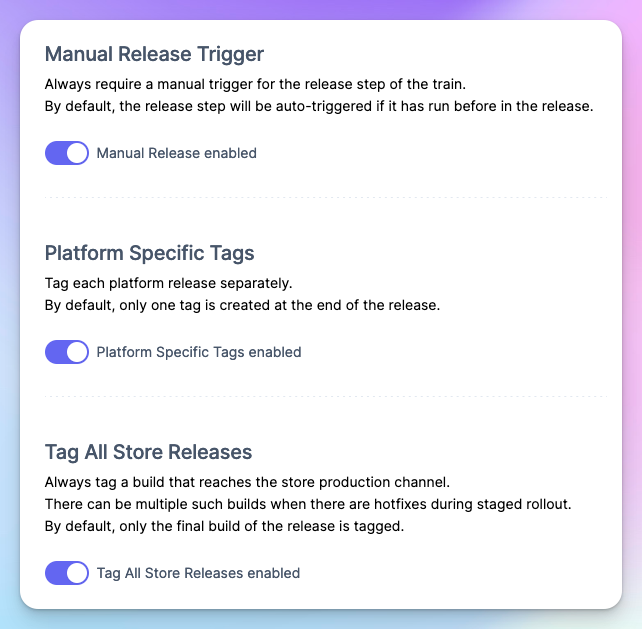

# September 21, 2023

### Enriched Release Activity

The **Event Timeline** has been renamed to **Release Activity**. While the essence of the page remains the same, it is now much more valuable. For cross-platform apps, the release activity for all platforms is displayed collectively in a single pane. You can optionally filter for a single platform if you want to isolate the activity. Additionally, it also logs the users that initiated particular manual actions, thereby functioning as a comprehensive audit log of all the activities carried out during a release.

### Deploy Action

We now recommend using the [deploy-action](https://github.com/tramlinehq/deploy-action) for those using GitHub actions as their CI/CD solution. This method bundles the various inputs (like version-code and version-name) that Tramline provides, into a single input. It also enables us to introduce new inputs without necessitating downstream modifications in the future.

GitHub currently does not support triggering CI workflows for a particular commit SHA and can only activate the HEAD of a branch. This restriction can lead to race-conditions within Tramline, potentially triggering workflows for an incorrect commit if it has been superseded by a new commit.

This action fixes that problem by checking out your repo to the correct commit ref.

### New Train configurations

You can now setup a couple of new configurations on your release train:

1. Tramline has been automatically triggering the release step if it's reached it before in a prior commit. Now, you have the ability to customize this - you can elect to manually approve before the release step is triggered.

2. For cross-platform apps, Tramline has been adding platform-specific tags to the last commit SHA that was deployed successfully to production. We've expanded this to now optionally add platform-specific tags to all commit SHAs that were even partially deployed to production, like in a staged rollout scenario.

### Tramline API

Tramline maintains extensive data regarding your releases, both during the run-time and for posterity. We've now implemented two API endpoints for you to access some of this information. This can assist in organizing aspects of your release process that Tramline does not currently handle natively.

See API docs [here](https://docs.tramline.app/api).

Improvements and Fixes

- When in hotfix mode, allow running deployments out-of-order
- Send auto-generated build notes to non-production groups on Play Store (previously only TestFlight and Firebase App Distribution were supported)
- Scheduled release trains now have a log of all scheduling attempts made (successful or otherwise), including the reasons for skipping them
- Allow collapsing the entire pane that lists all commits in a release to reclaim space and focus on the current build

