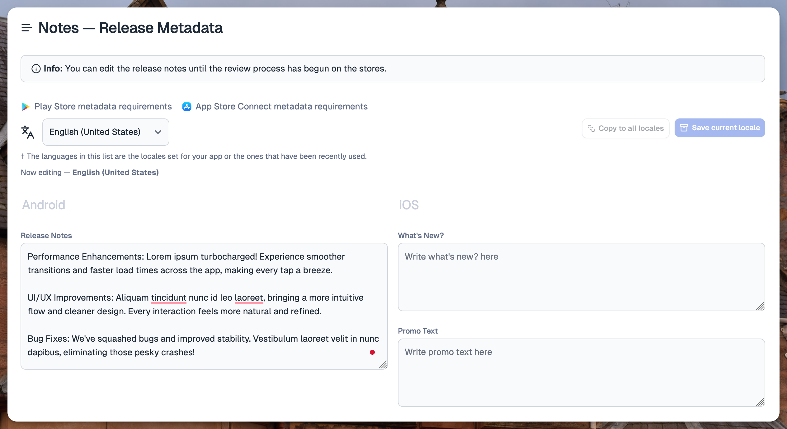

# September 24, 2024

### The work pane (live release page)

Tramline is conceptually a relatively rare paradigm of DevTools. Even other "release management" DevTools on the server-side like Heroku can operate more or less solely through a CLI. For bigger teams, Tramline is a high-touch tool where a lot of people end up collaborating. It is as much a GitHub as it is a Heroku.

This is why UX for Tramline is important. We can't just throw together some UI components and expect things to be useful. IA is important so that people can learn the "right flow" for releasing apps.

From this lens, we've made two broad changes.

1. Porting our [design system](/changelog/march-25-2024) over to the "work pane"
2. Simplifying the building blocks for configuring a release

#### Layout & design

The work pane is auto-structured into four main sections:

**Overview:** Issue tracking, changeset tracking and the homepage for the Release Captain.

**Stability:** Internal builds, Release Candidates, Testing.

**Metadata:** Dedicated space for updating notes, store metadata and screenshots.

**Store Release:** Managing reviews and rolling out to production.

Each of these categories have natural blocking

#### Configuring the release

### Improved UX around app submission

Because the design allows for more breathing room, we can focus on individual aspects of the release a bit better.

For example, there's a lot more control around app submission. You can cancel a running review in progress and you can also replace the build for an existing review with a new one or a previous valid one.

### Support for multi-locale release metadata

We now also support updating multiple languages for the release notes. When you start your release we pick up your last updated release notes, which you can edit before release.

On top of this, we also support updating multiple languages for both iOS and Android (for cross-platform apps) from the same place!

Improvements and Fixes

- Improve integration/config onboarding wizard
- Add a banner to prompt users to complete their profile
- Handle new Play Store errors – foreground services and account issues
- Handle unauthorized errors from App Store properly
- Allow internal testing releases when app is in draft mode
- Allow hotfix for a cross-platform app when one platform has started rollout

