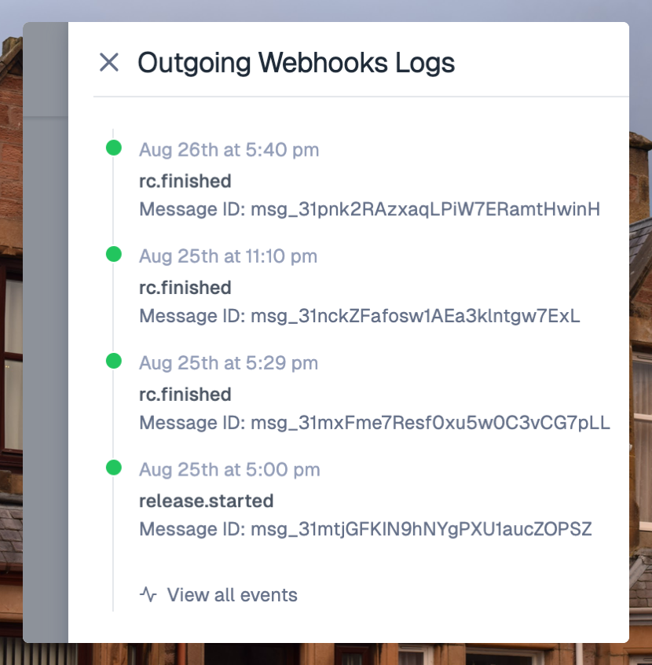

---
mdx:
 format: md
date: 2025-09-04
authors:
  - 'Animesh-Ghosh'
  - 'kitallis'
  - 'sberrevoets'
---

# September 4, 2025

### Outgoing Webhooks

Tramline's outgoing webhooks notify you in real-time when certain events happen in your release. Webhooks are HTTPS POST requests made to an endpoint of your choice that you can then implement custom business logic for. For example, you can receive a webhook when the release first kicks off. Your endpoint that receives this webhook can then process the payload of the webhook to automate some internal process you have based on this event, such as triggering a different pipeline, creating a ticket, or sending a custom notification or email to your team.

We currently support the following events:

- `release.started`
- `rc.finished`
- `release.completed`

Read more about configuring webhooks → [here](https://docs.tramline.app/using-tramline/quality-and-monitoring/outgoing-webhooks).

### Custom content in Slack notifications

  

Teams can now add custom user-defined content to their Slack notifications, providing additional context and personalized information alongside standard release updates. This enhancement allows release managers to include:

- Additional instructions for testing
- Important notes about the release
- Links to relevant documentation or dashboards
- Team-specific context or reminders
- Tagging specific users or groups about certain release events

  

The custom content appears as a separate section in Slack notifications and can be configured per notification type.

Read more about configuring custom notification content → [here](/using-tramline/quality-and-monitoring/notifications#custom-content).

### Flexible release branch names

Release branch naming is now fully customizable with dynamic token substitution. Teams can create branch naming patterns that automatically include contextual information like train names, release dates, and version numbers.

Available tokens include:
- `~trainName~`: The name of the release train
- `~releaseStartDate~`: Date when the release was started/will start
- `~releaseVersion~`: Version name of the release

For example, a pattern like `release/~trainName~/~releaseVersion~/~releaseStartDate~` would generate branch names like `release/production/1.2.0/2025-08-29`.

Read more about how tokens in patterns work → [here]( https://docs.tramline.app/using-tramline/release-management/embeddable-tokens)

Improvements and Fixes

- Enhanced error reporting when App Store rollouts fail to start
- Added automatic retries for release branch creation to improve reliability
- Retries for workflow triggers to handle transient failures for GitLab Pipelines
- Link to Release Activity page on Rollout timeline panel

<!-- truncate -->

