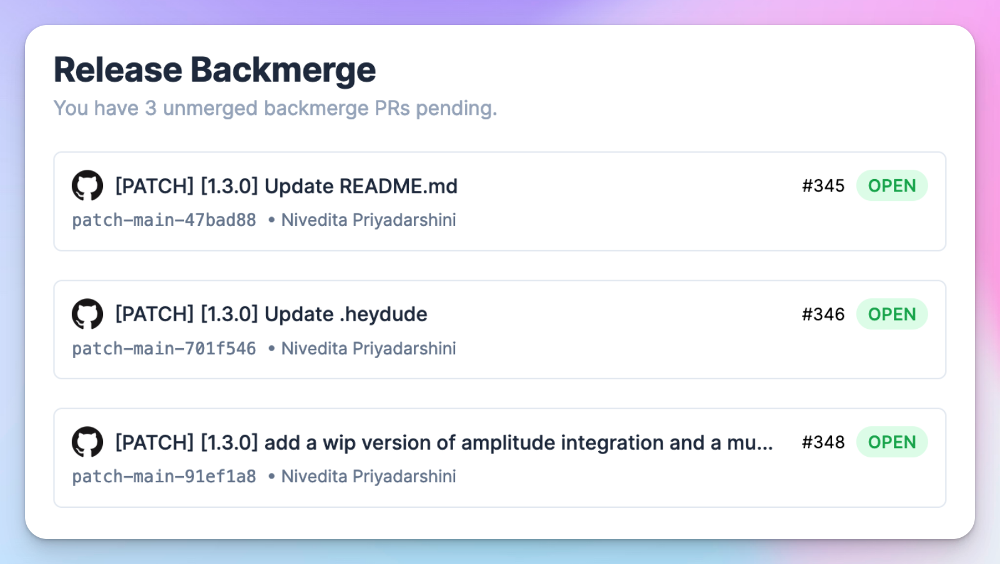
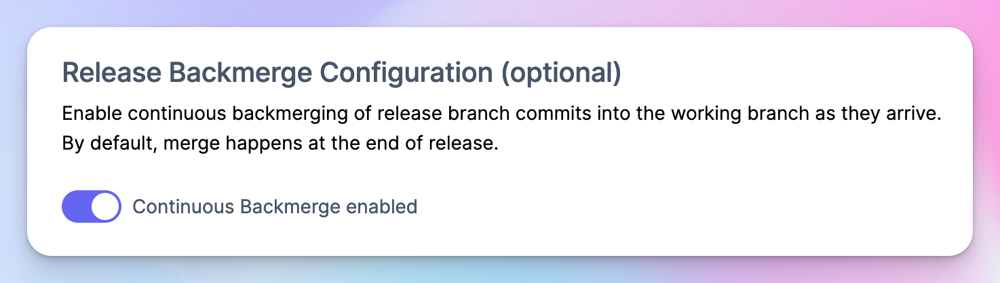
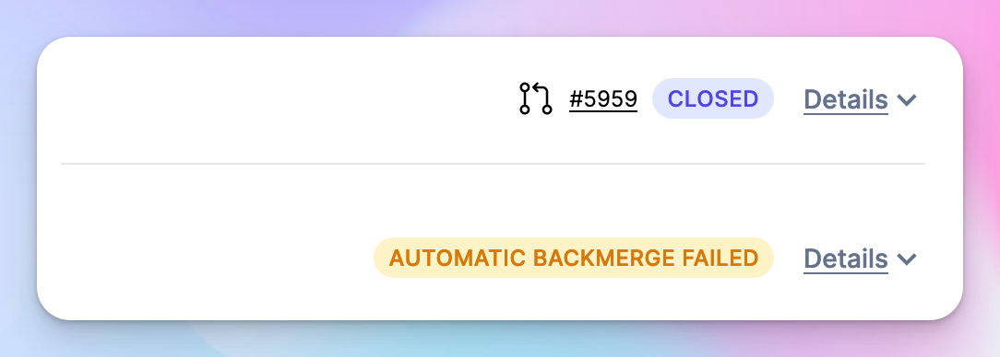
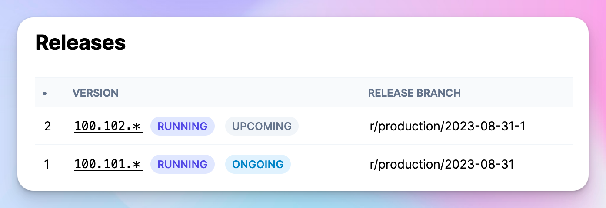

# September 8, 2023

### Continuously Backmerge

Up until now, Tramline only merged changes made in the release branch back into your working branch towards the **end** of a release. For teams who end up with a lot of changes in their release branch, it is essential to get new changes back as quickly as possible. Doing this avoids both merge hells at the end and hands control over to individuals to ensure they are merging their changes back.

Tramline now allows configuring a train to cherry-pick commits from the release branch and make individual Patch PRs and assign them to the original authors for them to drive their isolated changes back to the working branch (typically `main`).

This significantly reduces the burden on the release pilot wrangling backmerges by hand as new changes are landed, but more importantly, also adds visibility and individual accountability into the process.

Tramline generally still recommends an "almost trunk" strategy – wherein one cherry-picks commits from the working branch **to** the release branch. This of course, has many adoption constraints and isn't always organizationally feasible.

### Prepare an upcoming release

You can now start ramping up a new release before your current release finishes. This allows you to cut back on the additional time spent waiting for a full phased rollout to complete in the ongoing release and start stabalizing new features on the working branch.

This feature is available when you have a multi-step train (RC and production both) and you have phased rollouts enabled on your production step.

Improvements and Fixes

- The build queue commits are reverse chronologically order
- We now have formatted and mobile-friendly emails
- Build notes sent on TestFlight are size-truncated to the App Store limit
- You can edit release schedules as long as there isn't an active ongoing release
- Stronger password validations
- Addtional notifications around staged rollouts / phased releases
- Faster CI workflow triggers from Tramline

