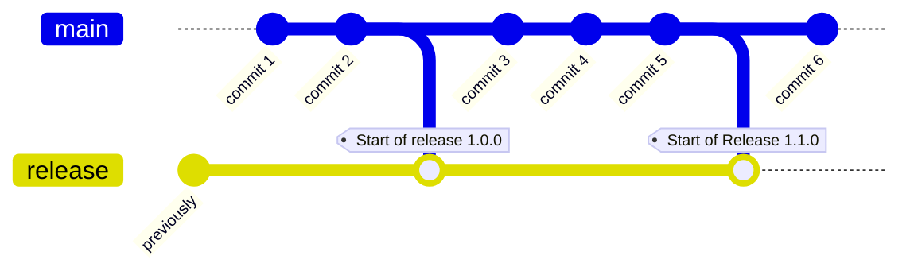

# 🤖 Automations

export const ReleaseBranch = ({name, n}) => {
    function date() {
        const today = new Date()
        const year = today.getFullYear()
        let month = today.getMonth() + 1
        let day = today.getDate()
        if (month < 10) {
            month = '0' + month
        }
        if (day < 10) {
            day = '0' + day
        }
        return `${year}-${month}-${day}`
    }
    return (<code>r/{name}/{date()}{n ? '-1' : ''}</code>)
};

Tramline automates away a lot of boilerplate work and opines on some sensible defaults. We will continue to add more automations and hopefully also add controls to chose which ones to run. Currently, some sensible automations (that everyone should do) are just magically done for you, and some require enabling manually.

If you have suggestions for common processes that Tramline can automate for you, which don't exist in this list down below, [please let us know](mailto:hello@tramline.app)!

### Cut a release branch

:::tip
This automation is run when a [new release is prepared](/using-tramline/new-release).
:::
:::info
Release branches are only cut for specific branching strategies. See [Branching Strategies](using-tramline/branching-strategies).
:::

On starting a new release, we automatically cut a release branch from the configured working branch for the repo. The release branch takes the pattern of `r/name-of-release-train/date-of-release`. For example, if your release train is called **Nightly**, the release branch will be <ReleaseBranch name="nightly" n=''/>. Additional releases during the day will be <ReleaseBranch name="nightly" n='1'/>.

### Pre-release pull requests

:::tip
This automation is run when a [new release is prepared](/using-tramline/new-release).
:::
:::info
Only works for [Parallel Working and Release Branch](/using-tramline/branching-strategies#parallel-working-and-release-branch) strategy.
:::

The working branch (eg. `main`) is merged into the static release branch (eg. `release`) automatically at the the start of every release.

### Start release flow for new commits

:::tip
This automation is run when [new commits land on the release branch](/using-tramline/release/stability).
:::

When you land fixes to your release branch for an active release, the Tramline release flow automatically kicks off again. If you have Internal Releases enabled, on the arrival of every new commit, a new internal release process will start. If you only have Release Candidates enabled, only the release candidate process will automatically start. When any of this happens, the previous internal or RC builds are marked as stale, so that you can start working on the fresh builds.

### Trigger workflows

:::tip
This automation is run when [new commits land on the release branch](/using-tramline/release/stability).
:::

When an internal or release candidate process starts, the associated workflow is automatically triggered. The subsequent updates to that workflow are also tracked and updated in the dashboard.

### Trigger distributions

:::info
Enable in the submissions settings for each submission when setting up the release.
:::

When a workflow finishes and a build is found, Tramline can optionally auto-submit the build to the configured distribution channel.

### Cancel previous workflow run

When a new commit lands, and if there's already a workflow running for a previous commit, Tramline will attempt to cancel the previous workflow run. We do this to avoid wasting compute minutes.

### Apply change queue

:::info
Enable build queues in your train setting for this automation
:::

### Track ongoing work

:::tip
This automation is always available as long as the release is active. See [changeset tracking](/using-tramline/release/changeset-tracking).
:::

All the pull requests that directly target the release branch (eg. `r/production/2022-12-31-1`) are automatically tracked and updated in the [changeset tracking](/using-tramline/release/changeset-tracking) dashboard.

### Bumping versions and build numbers

#### Versions

Versions are automatically managed by Tramline. New releases start with a minor or major version bump (in SemVer terminology). When fixes land in the middle of a production rollout, the patch version always gets auto-bumped for the new changes.

Similarly, when starting new hotfix releases, the patch version always get auto-bumped.

#### Build numbers

Every build created generated through Tramline always has a unique build number. This is true across workflows, and across trains. Tramline maintains an atomic counter internally and automatically updates the build number through the [workflow triggering](/using-tramline/release/stability) mechanism.

### Merging fixes back

:::tip
This is applicable for all [branching strategies](/using-tramline/branching-strategies).
:::

Tramline ensures that the code that's added to a release branch is always merged back into the working branch. It can be done in two ways:

#### Open a PR at the end of a release

This is the default setting. When your release is done, and if there are any fix commits that are in the release branch, Tramline will automatically open a pull request (and merge if possible) back to the working branch.

#### Continuously cherry-pick commits

:::info
Depending on the [VCS integration](/integrations/version-control), the way cherry-picks happen have will slight variations.
:::

When this is enabled, Tramline will continuously merge code back for every commit (or set of commits) that lands on the release branch. This is helpful for teams that do a number of fixes directly on the release branch so that the code is merged back to the "trunk" as _quickly_ as possible.

### Notifications

:::info
Enable Notifications in your train setting for this automation
:::

When a new build is available to download from Tramline, we now attach the build to the Slack notification where it can be directly downloaded for testing or other purposes.

### Create VCS tags

Once the release is finalized, we automatically tag the last commit that was released with the version generated by the release train. If the released version is `1.0.0`. The tag will be `v1.0.0`.

:::info
Enable release tagging in your train settings for this automation
:::

  - prod submission
  - final

### Create VCS release

:::tip
This automation runs right before the release is finalized or completed.
:::

If you're using the GitHub integration for source control, we will also create a [GitHub release](https://docs.github.com/en/repositories/releasing-projects-on-github/managing-releases-in-a-repository) with an auto-generated changelog.

### Pick the correct code for Hotfixes

### Start releases on a schedule

:::info
Add a release schedule to you train settings for this automation
:::

### Update Export Compliance Information in App Store Connect

If enabled, Tramline will automatically sets the `usesNonExemptEncryption` to be `false` for all builds as they get upload to the App Store.

### Upload builds to Tramline

By default, all builds generated by your CI workflows as artifacts are automatically uploaded to Tramline. This is true for all: `aab`, `apk` and `ipa` files.

### Default release notes from last release

Tramline will automatically apply 'What's new' text or release notes from your previous release version to populate the release notes for the current release.

Additionally, if you manually add new locales for your release notes directly on the stores, Tramline will automatically pull them up in the next release.

### Pull Requests
We wholly manage pull requests around release branches while starting and ending a release (depending on the branching strategy selected).

See [Branching Strategies](/using-tramline/branching-strategies) for more information.

  - enable auto-merge
  - merge on checks passing
