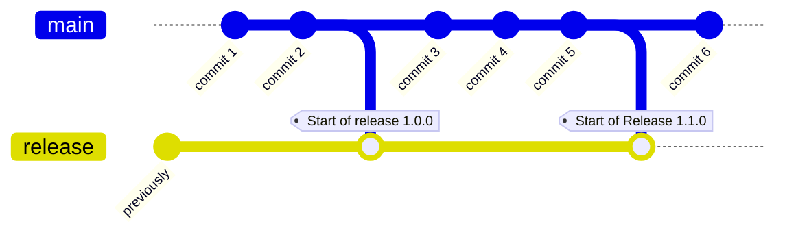

export const ReleaseBranch = ({name, n}) => {
    function date() {
        const today = new Date()
        const year = today.getFullYear()
        let month = today.getMonth() + 1
        let day = today.getDate()
        if (month < 10) {
            month = '0' + month
        }
        if (day < 10) {
            day = '0' + day
        }
        return `${year}-${month}-${day}`
    }
    return (<code>r/{name}/{date()}{n ? '-1' : ''}</code>)
};

Tramline automates away a lot of boilerplate work and opines on some sensible defaults. We will continue to add more automations and hopefully also add controls to chose which ones to run. Currently, some sensible automations (that everyone should do) are just magically done for you, and some require enabling manually.

If you have suggestions for common processes that Tramline can automate for you, which don't exist in this list down below, [please let us know](mailto:hello@tramline.app)!

## Cut a release branch

:::tip
This automation is run when a [new release is prepared](/using-tramline/release-management/new-release).
:::
:::info
Release branches are only cut for specific branching strategies. See [Branching Strategies](using-tramline/release-management/branching-strategies).
:::

On starting a new release, we automatically cut a release branch from the configured working branch for the repo. The release branch takes the pattern of `r/name-of-release-train/date-of-release`. For example, if your release train is called **Nightly**, the release branch will be <ReleaseBranch name="nightly" n=''/>. Additional releases during the day will be <ReleaseBranch name="nightly" n='1'/>.

## Pre-release pull requests

:::tip
This automation is run when a [new release is prepared](/using-tramline/release-management/new-release).
:::
:::info
Only works for [Parallel Working and Release Branch](/using-tramline/release-management/branching-strategies#parallel-working-and-release-branch) strategy.
:::

The working branch (eg. `main`) is merged into the static release branch (eg. `release`) automatically at the the start of every release.

## Start release flow for new commits

:::tip
This automation is run when [new commits land on the release branch](/using-tramline/working-pane/stability).
:::

When you land fixes to your release branch for an active release, the Tramline release flow automatically kicks off again. If you have Internal Releases enabled, on the arrival of every new commit, a new internal release process will start. If you only have Release Candidates enabled, only the release candidate process will automatically start. When any of this happens, the previous internal or RC builds are marked as stale, so that you can start working on the fresh builds.

## Trigger workflows

:::tip
This automation is run when [new commits land on the release branch](/using-tramline/working-pane/stability).
:::

When an internal or release candidate process starts, the associated workflow is automatically triggered. The subsequent updates to that workflow are also tracked and updated in the dashboard.

## Trigger distributions

:::info
Enable this in your [submission settings](/using-tramline/release-management/release-settings#submission-settings).
:::

When a workflow finishes and a build is found, Tramline can optionally auto-submit the build to the configured distribution channel.

## Auto-start rollout after submission

:::info
Enable this in your [production release settings](/using-tramline/release-management/release-settings#auto-start-rollout-after-submission).
:::

When enabled, Tramline automatically starts the production rollout as soon as the submission is approved (iOS) or prepared (Android), removing the need for a manual trigger. Pre-production releases always auto-start regardless of this setting.

## Automatic rollout

:::info
Enable this in your [production release settings](/using-tramline/release-management/release-settings#automatic-rollout).
:::

When enabled for Android, Tramline automatically progresses the staged rollout percentage once daily according to the configured sequence, as long as the release is [healthy](/using-tramline/quality-and-monitoring/release-health-monitoring). The rollout is automatically paused if health rules detect problems. On iOS, automatic rollouts are enabled by default for all phased releases.

## Cancel previous workflow run

When a new commit lands, and if there's already a workflow running for a previous commit, Tramline will attempt to cancel the previous workflow run. We do this to avoid wasting compute minutes.

## Apply change queue

:::info
Enable build queues in your [release train settings](/using-tramline/release-management/release-settings#advanced-settings).
:::

Changes that land on the release branch can optionally be staged in a [Change Queue](/using-tramline/build-processing/build-queue). The change queue gets automatically drained if either the number of changes in the queue exceed the configured limit or if the configured batch-time has passed.

## Track ongoing work

:::tip
This automation is always available as long as the release is active. See [changeset tracking](/using-tramline/working-pane/changeset-tracking).
:::

All the pull requests that directly target the release branch (eg. `r/production/2022-12-31-1`) are automatically tracked and updated in the [changeset tracking](/using-tramline/working-pane/changeset-tracking) dashboard.

## Bumping versions and build numbers

### Versions

Versions are automatically managed by Tramline. New releases start with a minor or major version bump (in SemVer terminology). When fixes land in the middle of a production rollout, the patch version always gets auto-bumped for the new changes.

Similarly, when starting new hotfix releases, the patch version always get auto-bumped.

### Build numbers

Every build created generated through Tramline always has a unique build number. This is true across workflows, and across trains. Tramline maintains an atomic counter internally and automatically updates the build number through the [workflow triggering](/using-tramline/working-pane/stability) mechanism.

## Merging fixes back

:::tip
This is applicable for all [branching strategies](/using-tramline/release-management/branching-strategies).
:::
:::tip
Tramline will always automatically try to merge (not just create) all PRs that are created by Tramline, whenever possible (depending on required checks etc.).
:::

Tramline can automatically backmerge changes from the release branch to your working branch and any upcoming release branches. There are two backmerge strategy options available.

### Continuously as changes land

Any PRs or commits merged into the release branch will be "backmerged" into the working branch. As new changes land, this process repeats so that the working branch is always up to date with the release branch. This is helpful for teams that do a number of fixes directly on the release branch so that the code is merged back to the "trunk" as _quickly_ as possible.

:::info
Depending on the [VCS integration](/integrations/version-control), the way cherry-picks happen have will slight variations.
:::

These running PRs created by Tramline are sometimes referred to as _Patch PRs_. These PRs get also get assigned to the original authors of the relevant change/commit.

### End of release

:::info
A backmerge branch will only be created if commits are found on the release branch that are not on the working branch.
:::

At the end of the release cycle, Tramline will create a backmerge branch and open a pull request to merge the release branch back into the working branch and also to any upcoming release branch.

## Notifications

:::info
Enable [Notifications](/using-tramline/quality-and-monitoring/notifications) in your [release train settings](/using-tramline/release-management/release-settings).
:::

### Attach builds

Along with all the available notifications, the "build available" notification specifically attaches the Internal or Release Candidate build as a part of the Slack notification. This is helpful for QAs or other folks in the configured Slack channel to quickly download the build for testing.

### Tester notes

When a new build is available to download from Tramline, in addition to the build itself, Tramline also sends the list of changes that were made for the build (since the last build) in the Slack notification. This tells anyone who is downloading the build what changes were made in it. The same information is also available in the Tramline dashboard.

## Create VCS tags

:::info
Enable tagging in your [release train settings](/using-tramline/release-management/release-settings).
:::

Tramline cuts git tags on your version control in a couple of different scenarios:

### End of a release

When the release ends, we automatically tag the last commit that was released at the end. If the released version is `1.0.0`. The tag will be `v1.0.0`.

### When a production submission finishes

For cases where you anticipate sending more than one build to the store, we also allow tagging each submission that actually went to the store. So in a single release, if you first partially release 1.0.0 to the production track on Play Store, and then land a patch fix and release 1.0.1 to 100%, you will get two tags: `v1.0.0` and `v1.0.1` against the appropriate commits.

## Create VCS release

:::tip
VCS releases are created at the [end of a release](#end-of-a-release).
:::

If you're using the [GitHub integration](/integrations/version-control/github) for version control, Tramline will automatically create a [GitHub release](https://docs.github.com/en/repositories/releasing-projects-on-github/managing-releases-in-a-repository) with an auto-generated changelog.

## Pick the correct version for hotfixes

When you start a [hotfix release](/using-tramline/special-cases/fix-releases#hotfix), Tramline will automatically pick the correct version to be hotfix'd (the last completed release). When the hotfix release starts, and if there's a diff — between the current hotfix changes and the last release — the release will jump straight into to creating a new Release Candidate build and will skip Internal builds to save time.

## Start releases on a schedule

:::info
Add a schedule to your release in the [release train settings](/using-tramline/release-management/release-settings).
:::

[Scheduled releases](/using-tramline/release-management/scheduled-release) automatically start a new release on the specified date and retain the schedule for subsequent releases. You can also optionally set a scheduled release to automatically stop on failure.

Additionally, if your release spans across a future release, the future release gets automatically adjusted.

## Update Export Compliance Information in App Store Connect

If enabled, Tramline will automatically sets the `usesNonExemptEncryption` to be `false` for all builds as they get upload to the App Store.

## Upload builds to Tramline

By default, all builds generated by your CI workflows as artifacts are automatically uploaded to Tramline. This is true for the following file types: `aab`, `apk` and `ipa`. They are subsequently also available for download from the [Tramline dashboard](/using-tramline/working-pane/stability) and [Slack notifications](/using-tramline/quality-and-monitoring/notifications).

## Default release notes from last release

Tramline will automatically apply "What's new" text or release notes from your previous release version to populate the release notes for the current release.

Additionally, if you manually add new locales for your release notes directly on the stores, Tramline will automatically pull them up in the next release.

## Pull Requests

:::tip
Pull requests are created under a variety of circumstances ([see above](/automations)).
:::

There are a few default automatic settings for all pull requests created by Tramline:

 * If the PR is on the [GitHub VCS integration](/integrations/version-control/github), Tramline will try to set the [auto-merge](https://docs.github.com/en/pull-requests/collaborating-with-pull-requests/incorporating-changes-from-a-pull-request/automatically-merging-a-pull-request) option (if possible).
 * Even if auto-merge flag is not possible (eg. other VCS integrations), Tramline will continually try to auto-merge until all the checks pass.
 * For [cherry-pick PRs](/changelog/september-8-2023#continuously-backmerge) (or "patch" PRs), Tramline will reference-tag the name of the author of the cherry-pick commit in the body of the PR.
