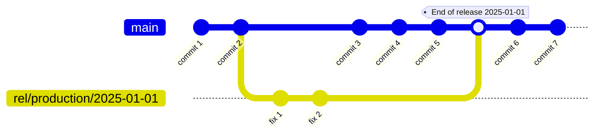
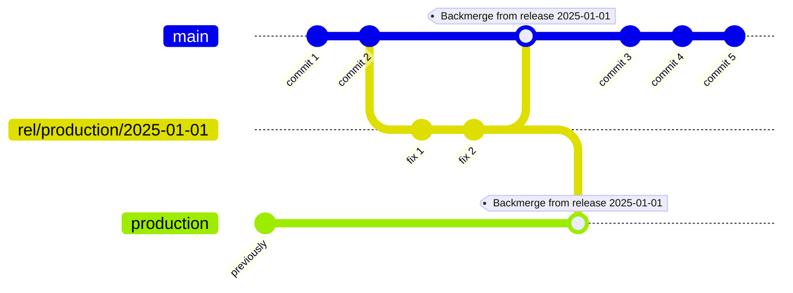
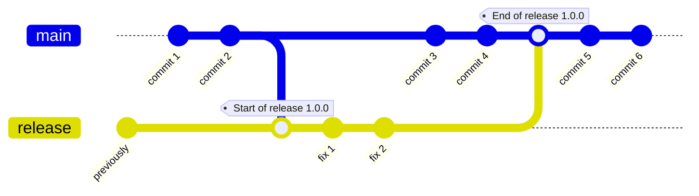

:::tip
**Three** types of branching strategies are currently supported when [setting up a release](/using-tramline/release-management/release-settings).
:::

:::info
There are various automations around these branching strategies that help manage merges, create pull requests, cut tags etc. See [Automations](/automations.mdx) for more information.
:::

## Almost Trunk
Almost Trunk is the simplest strategy and the one that we generally recommend.

For every release, we create a new release branch from the `HEAD` of the working branch. Release-specific fixes should not be committed to the release branch directly. Instead, you should land the fixes on your working branch, and then cherry-pick them on to the release branch.

#### Under release settings

## Release with Backmerge

Release with Backmerge creates a new release branch from the `HEAD` of the working branch, for every release. Once the release is finalized, two things happen:

1. The release branch is merged into the backmerge (production) branch
2. The backmerge branch is "backmerged" into the working branch

#### Under release settings

## Parallel Working and Release Branch

Parallel Working and Release does not create a new release branch for every release. Instead, at the start of a release, the working branch is merged into the release branch. Release-specific fixes land on the release branch directly. At the end of the release, the release branch is merged back into the working branch.

#### Under release settings

## Trunk-based

:::info
This branching strategy is currently in beta and will be publicly available in mid-2025.
:::

Trunk-based branching strategy releases from a single, long-lived branch that's used for both development and releases. No new branches are created. The `HEAD` of trunk is simply tagged and a release is started from that point onwards. Additional fixes to the release can be optionally picked into the release.
